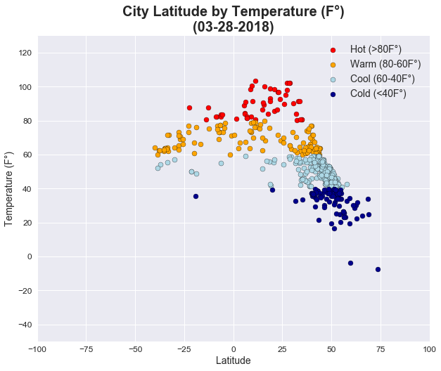
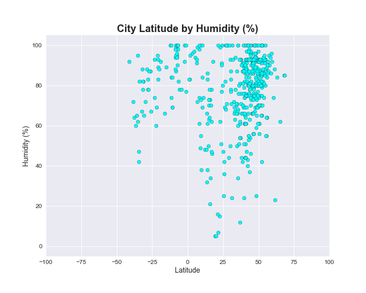
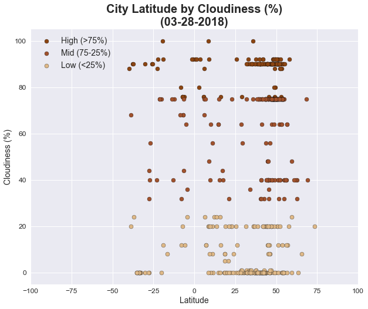
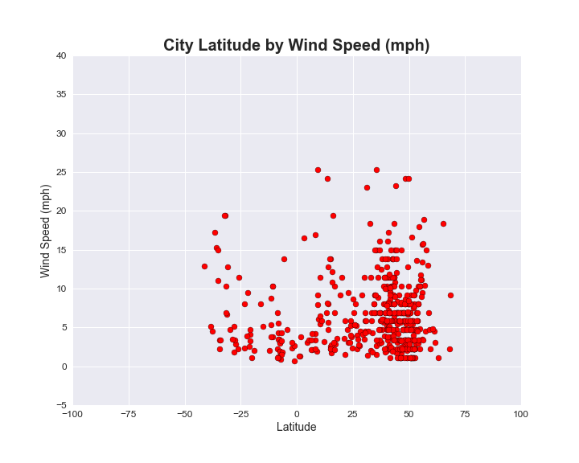

<b><u>Observations</b></u>
<p>1. My data is skewed towards cities in the northern hemisphere (i.e., positive latitudes).  This isn't unusual since the vast majority of the global population is above the equater, but it's clear that there are way more dots on the right hand side of each chart than the left hand side.</p>
<p>2. In looking around +50 degrees latitude, there is a cluster of cities with ~70-90% humidity.  Outside of that, humidity levels were fairly dispersed across cities.</p>
<p>3. The trend for humidity described above is also similar for wind speed.  There is a bunch of of cities around +50 degrees latitude that have a wind speed between 0-10 mph.  There doesn't seem to be an obvious pattern for cities below +50 degrees latitude.</p>

I'm curious to see what trends would emerge if I used a much larger sample size or if I ran this script a few dozen times and compared the results.</p>


```python
# Dependencies
import numpy as np
import random
import json
import requests
from pprint import pprint
from config import api_key
import pandas as pd
import seaborn as sns
import matplotlib.pyplot as plt
import datetime

# Wrapper for OpenWeatherMap
# Will use this to view sample JSON API response
import openweathermapy.core as owm

# Dependencies for downloading and uncompressing list of cities from OpenWeatherMap
import urllib.request
import gzip

# Set the seaborn chart style
sns.set()

# Increase the size of the scatter plots
plt.rcParams["figure.figsize"] = [10,8]

# Store today's date
date = datetime.datetime.now().strftime("%m-%d-%Y")
```


```python
# Print out a sample JSON API response
settings = {"units": "imperial", "appid": api_key}
pprint(owm.get_current(2172797, **settings))
```

    {'base': 'stations',
     'clouds': {'all': 75},
     'cod': 200,
     'coord': {'lat': -16.92, 'lon': 145.77},
     'dt': 1522231200,
     'id': 2172797,
     'main': {'humidity': 94,
              'pressure': 1009,
              'temp': 78.8,
              'temp_max': 78.8,
              'temp_min': 78.8},
     'name': 'Cairns',
     'sys': {'country': 'AU',
             'id': 8166,
             'message': 0.0039,
             'sunrise': 1522182131,
             'sunset': 1522225289,
             'type': 1},
     'visibility': 10000,
     'weather': [{'description': 'light intensity shower rain',
                  'icon': '09n',
                  'id': 520,
                  'main': 'Rain'}],
     'wind': {'deg': 150, 'speed': 5.82}}
    

<h1>Download City List</h1>


```python
# This section downloads the list of cities and IDs that OpenWeatherMap uses from their website
# Decided this was more efficient than creating a list of cities using citipy and 
#   latitudes/longitudes since OpenWeatherMap says results will be more accurate if you use IDs instead of names

# File names
city_index_zip_file = "city.list.json.gz"
city_index_json_file = 'city.list.json'

# Download file
urllib.request.urlretrieve ("http://bulk.openweathermap.org/sample/city.list.json.gz", city_index_zip_file)

# Uncompress gzip file to json
inF = gzip.open(city_index_zip_file, 'rb')
outF = open(city_index_json_file, 'wb')
outF.write(inF.read())
inF.close()
outF.close()

# Read json file into a dataframe
city_index_df = pd.read_json(city_index_json_file)

# Print top five rows
city_index_df.head()
```


<div>
<style>
    .dataframe thead tr:only-child th {
        text-align: right;
    }

    .dataframe thead th {
        text-align: left;
    }

    .dataframe tbody tr th {
        vertical-align: top;
    }
</style>
<table border="1" class="dataframe">
  <thead>
    <tr style="text-align: right;">
      <th></th>
      <th>coord</th>
      <th>country</th>
      <th>id</th>
      <th>name</th>
    </tr>
  </thead>
  <tbody>
    <tr>
      <th>0</th>
      <td>{'lon': 34.283333, 'lat': 44.549999}</td>
      <td>UA</td>
      <td>707860</td>
      <td>Hurzuf</td>
    </tr>
    <tr>
      <th>1</th>
      <td>{'lon': 37.666668, 'lat': 55.683334}</td>
      <td>RU</td>
      <td>519188</td>
      <td>Novinki</td>
    </tr>
    <tr>
      <th>2</th>
      <td>{'lon': 84.633331, 'lat': 28}</td>
      <td>NP</td>
      <td>1283378</td>
      <td>Gorkh�</td>
    </tr>
    <tr>
      <th>3</th>
      <td>{'lon': 76, 'lat': 29}</td>
      <td>IN</td>
      <td>1270260</td>
      <td>State of Hary�na</td>
    </tr>
    <tr>
      <th>4</th>
      <td>{'lon': 33.900002, 'lat': 44.599998}</td>
      <td>UA</td>
      <td>708546</td>
      <td>Holubynka</td>
    </tr>
  </tbody>
</table>
</div>


<h1>Generate City List</h1>


```python
# This section selects 555 random cities from the above city index dataframe

# Start by creating an empty dataframe
random_city_df = pd.DataFrame(columns=['coord', 'country', 'id', 'name', 'lon', 'lat'])

# Set counter to zero for looping
counter = 0

# Set total number of random cities
total_cities = 555

# Loop while counter is less than number of cities
while counter < total_cities:
    
    # Pick a random row (must be length - 1 since row starts at 0)
    row = random.randint(0, len(city_index_df)-1)
    
    # If ID is already in the dataframe then do nothing and repeat loop
    if any(random_city_df.id == city_index_df['id'][row]):
        pass
    
    # If ID isn't in the dataframe then add that row to the dataframe, including latitude and longitude
    else:
        random_city_df.loc[counter] = city_index_df.iloc[row,:]
        random_city_df.lat[counter] = city_index_df['coord'][row]['lat']
        random_city_df.lon[counter] = city_index_df['coord'][row]['lon']
        counter = counter + 1
        
# Change latitude and longitude columns from object to float
random_city_df[['lat','lon']] = random_city_df[['lat','lon']].apply(pd.to_numeric)
```

<h1>Weather API Call</h1>


```python
# This section does the API calls from OpenWeatherMap

# Create empty lists for temperature, humidity, cloudiness and windspeed
# This will get added to the dataframe of cities
city_temp_list = []
city_humidity_list = []
city_cloudiness_list = []
city_windspeed_list = []

# Loop through the total number of cities
for index in range(total_cities):
    
    # Print out 
    print(f"Request {index+1} of {total_cities}: {random_city_df['name'][index]}")
    
    # Create the URL
    url = "http://api.openweathermap.org/data/2.5/weather?APPID="+api_key+"&units=imperial&id="+str(random_city_df.id[index])
    
    # Print the URl but mask the api key
    print("http://api.openweathermap.org/data/2.5/weather?APPID=xxxxx&units=imperial&id="+str(random_city_df.id[index]))

    # Do the API call
    response = requests.get(url)
    
    # Convert API response to JSON
    data = response.json()
    
    # Grab temperature, humidity, cloudiness and windspeed and add it to their respective list    
    city_temp_list.append(data['main']['temp'])
    city_humidity_list.append(data['main']['humidity'])
    city_cloudiness_list.append(data['clouds']['all'])
    city_windspeed_list.append(data['wind']['speed'])

# Add temperature, humidity, cloudiness and windspeed as a column in the dataframe
random_city_df['temp'] = city_temp_list
random_city_df['humidity'] = city_humidity_list
random_city_df['cloudiness'] = city_cloudiness_list
random_city_df['windspeed'] = city_windspeed_list
```

    Request 1 of 555: Szydlowiec
    http://api.openweathermap.org/data/2.5/weather?APPID=xxxxx&units=imperial&id=757178
    Request 2 of 555: Bennhausen
    http://api.openweathermap.org/data/2.5/weather?APPID=xxxxx&units=imperial&id=2951024
    Request 3 of 555: Mogosani
    http://api.openweathermap.org/data/2.5/weather?APPID=xxxxx&units=imperial&id=672955
    Request 4 of 555: Hochfelden
    http://api.openweathermap.org/data/2.5/weather?APPID=xxxxx&units=imperial&id=6291215
    Request 5 of 555: Montiano
    http://api.openweathermap.org/data/2.5/weather?APPID=xxxxx&units=imperial&id=3172700
    Request 6 of 555: Préfecture de la Ouaka
    http://api.openweathermap.org/data/2.5/weather?APPID=xxxxx&units=imperial&id=236887
    Request 7 of 555: Paiguano
    http://api.openweathermap.org/data/2.5/weather?APPID=xxxxx&units=imperial&id=3877770
    Request 8 of 555: Claviere
    http://api.openweathermap.org/data/2.5/weather?APPID=xxxxx&units=imperial&id=3178550
    Request 9 of 555: Thiel-sur-Acolin
    http://api.openweathermap.org/data/2.5/weather?APPID=xxxxx&units=imperial&id=2972868
    Request 10 of 555: Campti
    http://api.openweathermap.org/data/2.5/weather?APPID=xxxxx&units=imperial&id=4318812
    Request 11 of 555: Vailly-sur-Aisne
    http://api.openweathermap.org/data/2.5/weather?APPID=xxxxx&units=imperial&id=2971169
    Request 12 of 555: Auw
    http://api.openweathermap.org/data/2.5/weather?APPID=xxxxx&units=imperial&id=2661663
    Request 13 of 555: Pervorosiyskiy
    http://api.openweathermap.org/data/2.5/weather?APPID=xxxxx&units=imperial&id=1520196
    Request 14 of 555: Kimiidera
    http://api.openweathermap.org/data/2.5/weather?APPID=xxxxx&units=imperial&id=1859472
    Request 15 of 555: Maler Kotla
    http://api.openweathermap.org/data/2.5/weather?APPID=xxxxx&units=imperial&id=1264111
    Request 16 of 555: Ausservillgraten
    http://api.openweathermap.org/data/2.5/weather?APPID=xxxxx&units=imperial&id=2782118
    Request 17 of 555: Jinqiao
    http://api.openweathermap.org/data/2.5/weather?APPID=xxxxx&units=imperial&id=1924937
    Request 18 of 555: Crown Heights
    http://api.openweathermap.org/data/2.5/weather?APPID=xxxxx&units=imperial&id=5114252
    Request 19 of 555: Lexington
    http://api.openweathermap.org/data/2.5/weather?APPID=xxxxx&units=imperial&id=4475773
    Request 20 of 555: Belance
    http://api.openweathermap.org/data/2.5/weather?APPID=xxxxx&units=imperial&id=1725623
    Request 21 of 555: Newtownstewart
    http://api.openweathermap.org/data/2.5/weather?APPID=xxxxx&units=imperial&id=2641511
    Request 22 of 555: Montferrat
    http://api.openweathermap.org/data/2.5/weather?APPID=xxxxx&units=imperial&id=6451504
    Request 23 of 555: Saint-Évarzec
    http://api.openweathermap.org/data/2.5/weather?APPID=xxxxx&units=imperial&id=6431042
    Request 24 of 555: Ust-Ilimsk
    http://api.openweathermap.org/data/2.5/weather?APPID=xxxxx&units=imperial&id=2013952
    Request 25 of 555: Montmagny
    http://api.openweathermap.org/data/2.5/weather?APPID=xxxxx&units=imperial&id=6612928
    Request 26 of 555: Zacatelco
    http://api.openweathermap.org/data/2.5/weather?APPID=xxxxx&units=imperial&id=3815392
    Request 27 of 555: Belén
    http://api.openweathermap.org/data/2.5/weather?APPID=xxxxx&units=imperial&id=3689002
    Request 28 of 555: Poleto
    http://api.openweathermap.org/data/2.5/weather?APPID=xxxxx&units=imperial&id=6459671
    Request 29 of 555: Kurikka
    http://api.openweathermap.org/data/2.5/weather?APPID=xxxxx&units=imperial&id=650095
    Request 30 of 555: Przyborow
    http://api.openweathermap.org/data/2.5/weather?APPID=xxxxx&units=imperial&id=3087895
    Request 31 of 555: Gemeente Tholen
    http://api.openweathermap.org/data/2.5/weather?APPID=xxxxx&units=imperial&id=2746350
    Request 32 of 555: Wendelsheim
    http://api.openweathermap.org/data/2.5/weather?APPID=xxxxx&units=imperial&id=2811296
    Request 33 of 555: Dębno
    http://api.openweathermap.org/data/2.5/weather?APPID=xxxxx&units=imperial&id=7533158
    Request 34 of 555: Desaignes
    http://api.openweathermap.org/data/2.5/weather?APPID=xxxxx&units=imperial&id=3021550
    Request 35 of 555: Airport Village
    http://api.openweathermap.org/data/2.5/weather?APPID=xxxxx&units=imperial&id=4099141
    Request 36 of 555: Keera
    http://api.openweathermap.org/data/2.5/weather?APPID=xxxxx&units=imperial&id=2161732
    Request 37 of 555: Baoshan
    http://api.openweathermap.org/data/2.5/weather?APPID=xxxxx&units=imperial&id=2038438
    Request 38 of 555: Dishna
    http://api.openweathermap.org/data/2.5/weather?APPID=xxxxx&units=imperial&id=358115
    Request 39 of 555: San Giorgio di Pesaro
    http://api.openweathermap.org/data/2.5/weather?APPID=xxxxx&units=imperial&id=3168301
    Request 40 of 555: Yatala
    http://api.openweathermap.org/data/2.5/weather?APPID=xxxxx&units=imperial&id=2142409
    Request 41 of 555: Subligny
    http://api.openweathermap.org/data/2.5/weather?APPID=xxxxx&units=imperial&id=2973758
    Request 42 of 555: Conscenti
    http://api.openweathermap.org/data/2.5/weather?APPID=xxxxx&units=imperial&id=3172350
    Request 43 of 555: Biloli
    http://api.openweathermap.org/data/2.5/weather?APPID=xxxxx&units=imperial&id=1275601
    Request 44 of 555: Hazlehurst
    http://api.openweathermap.org/data/2.5/weather?APPID=xxxxx&units=imperial&id=4199778
    Request 45 of 555: Brouqueyran
    http://api.openweathermap.org/data/2.5/weather?APPID=xxxxx&units=imperial&id=3029872
    Request 46 of 555: Locquirec
    http://api.openweathermap.org/data/2.5/weather?APPID=xxxxx&units=imperial&id=2997947
    Request 47 of 555: Ban Mae Wan
    http://api.openweathermap.org/data/2.5/weather?APPID=xxxxx&units=imperial&id=1119013
    Request 48 of 555: Balintore
    http://api.openweathermap.org/data/2.5/weather?APPID=xxxxx&units=imperial&id=2656575
    Request 49 of 555: Landkreis Cham
    http://api.openweathermap.org/data/2.5/weather?APPID=xxxxx&units=imperial&id=2940202
    Request 50 of 555: Wiesenau
    http://api.openweathermap.org/data/2.5/weather?APPID=xxxxx&units=imperial&id=2809285
    Request 51 of 555: Ellern
    http://api.openweathermap.org/data/2.5/weather?APPID=xxxxx&units=imperial&id=2930996
    Request 52 of 555: Britz
    http://api.openweathermap.org/data/2.5/weather?APPID=xxxxx&units=imperial&id=2944028
    Request 53 of 555: Arrondissement de Pau
    http://api.openweathermap.org/data/2.5/weather?APPID=xxxxx&units=imperial&id=2988356
    Request 54 of 555: Castellnovo
    http://api.openweathermap.org/data/2.5/weather?APPID=xxxxx&units=imperial&id=6356994
    Request 55 of 555: Enterprise
    http://api.openweathermap.org/data/2.5/weather?APPID=xxxxx&units=imperial&id=5503766
    Request 56 of 555: North Melbourne
    http://api.openweathermap.org/data/2.5/weather?APPID=xxxxx&units=imperial&id=7281804
    Request 57 of 555: Mangrol
    http://api.openweathermap.org/data/2.5/weather?APPID=xxxxx&units=imperial&id=1263752
    Request 58 of 555: Farley
    http://api.openweathermap.org/data/2.5/weather?APPID=xxxxx&units=imperial&id=2166856
    Request 59 of 555: Tokh-Aul
    http://api.openweathermap.org/data/2.5/weather?APPID=xxxxx&units=imperial&id=823639
    Request 60 of 555: Banjiang
    http://api.openweathermap.org/data/2.5/weather?APPID=xxxxx&units=imperial&id=1917139
    Request 61 of 555: Landkreis Altenburg
    http://api.openweathermap.org/data/2.5/weather?APPID=xxxxx&units=imperial&id=2957763
    Request 62 of 555: Ohatchee
    http://api.openweathermap.org/data/2.5/weather?APPID=xxxxx&units=imperial&id=4081197
    Request 63 of 555: Gschnitz
    http://api.openweathermap.org/data/2.5/weather?APPID=xxxxx&units=imperial&id=3319569
    Request 64 of 555: Anloo
    http://api.openweathermap.org/data/2.5/weather?APPID=xxxxx&units=imperial&id=2759746
    Request 65 of 555: Charroux
    http://api.openweathermap.org/data/2.5/weather?APPID=xxxxx&units=imperial&id=6615685
    Request 66 of 555: Kamieniec Zabkowicki
    http://api.openweathermap.org/data/2.5/weather?APPID=xxxxx&units=imperial&id=3096795
    Request 67 of 555: Wingfield
    http://api.openweathermap.org/data/2.5/weather?APPID=xxxxx&units=imperial&id=2633823
    Request 68 of 555: Shadrikha
    http://api.openweathermap.org/data/2.5/weather?APPID=xxxxx&units=imperial&id=6314508
    Request 69 of 555: Contreras
    http://api.openweathermap.org/data/2.5/weather?APPID=xxxxx&units=imperial&id=6356416
    Request 70 of 555: Mocorito
    http://api.openweathermap.org/data/2.5/weather?APPID=xxxxx&units=imperial&id=3995652
    Request 71 of 555: Alhadas
    http://api.openweathermap.org/data/2.5/weather?APPID=xxxxx&units=imperial&id=2743076
    Request 72 of 555: Seen (Kreis 3) / Waldegg
    http://api.openweathermap.org/data/2.5/weather?APPID=xxxxx&units=imperial&id=6295131
    Request 73 of 555: Taruma
    http://api.openweathermap.org/data/2.5/weather?APPID=xxxxx&units=imperial&id=3446718
    Request 74 of 555: Tonala
    http://api.openweathermap.org/data/2.5/weather?APPID=xxxxx&units=imperial&id=3981369
    Request 75 of 555: Silver Ridge
    http://api.openweathermap.org/data/2.5/weather?APPID=xxxxx&units=imperial&id=4504131
    Request 76 of 555: Vergigny
    http://api.openweathermap.org/data/2.5/weather?APPID=xxxxx&units=imperial&id=2969926
    Request 77 of 555: Bagamoyo
    http://api.openweathermap.org/data/2.5/weather?APPID=xxxxx&units=imperial&id=161290
    Request 78 of 555: Wendisch Priborn
    http://api.openweathermap.org/data/2.5/weather?APPID=xxxxx&units=imperial&id=6548394
    Request 79 of 555: Firenze
    http://api.openweathermap.org/data/2.5/weather?APPID=xxxxx&units=imperial&id=3176959
    Request 80 of 555: Waverly
    http://api.openweathermap.org/data/2.5/weather?APPID=xxxxx&units=imperial&id=5014208
    Request 81 of 555: Dudendorf
    http://api.openweathermap.org/data/2.5/weather?APPID=xxxxx&units=imperial&id=2934739
    Request 82 of 555: Predore
    http://api.openweathermap.org/data/2.5/weather?APPID=xxxxx&units=imperial&id=3169872
    Request 83 of 555: Nieder-Olm
    http://api.openweathermap.org/data/2.5/weather?APPID=xxxxx&units=imperial&id=2863014
    Request 84 of 555: ‘Alī al Aḩmad
    http://api.openweathermap.org/data/2.5/weather?APPID=xxxxx&units=imperial&id=99308
    Request 85 of 555: Tukhkala
    http://api.openweathermap.org/data/2.5/weather?APPID=xxxxx&units=imperial&id=480608
    Request 86 of 555: Saint-Hilaire-de-Loulay
    http://api.openweathermap.org/data/2.5/weather?APPID=xxxxx&units=imperial&id=6445198
    Request 87 of 555: Saint-Martin-de-Valgalgues
    http://api.openweathermap.org/data/2.5/weather?APPID=xxxxx&units=imperial&id=2978325
    Request 88 of 555: Waldsieversdorf
    http://api.openweathermap.org/data/2.5/weather?APPID=xxxxx&units=imperial&id=6547616
    Request 89 of 555: Ngroto
    http://api.openweathermap.org/data/2.5/weather?APPID=xxxxx&units=imperial&id=7035853
    Request 90 of 555: Johannis-Vorstadt
    http://api.openweathermap.org/data/2.5/weather?APPID=xxxxx&units=imperial&id=2894754
    Request 91 of 555: Leezen
    http://api.openweathermap.org/data/2.5/weather?APPID=xxxxx&units=imperial&id=6552115
    Request 92 of 555: Groß Schwaß
    http://api.openweathermap.org/data/2.5/weather?APPID=xxxxx&units=imperial&id=2915048
    Request 93 of 555: Quarouble
    http://api.openweathermap.org/data/2.5/weather?APPID=xxxxx&units=imperial&id=6438425
    Request 94 of 555: Zhilploshchadka
    http://api.openweathermap.org/data/2.5/weather?APPID=xxxxx&units=imperial&id=463001
    Request 95 of 555: Linstead Place
    http://api.openweathermap.org/data/2.5/weather?APPID=xxxxx&units=imperial&id=5830426
    Request 96 of 555: La Clarita
    http://api.openweathermap.org/data/2.5/weather?APPID=xxxxx&units=imperial&id=3807669
    Request 97 of 555: Departamento de San Ignacio
    http://api.openweathermap.org/data/2.5/weather?APPID=xxxxx&units=imperial&id=3429014
    Request 98 of 555: Dikson
    http://api.openweathermap.org/data/2.5/weather?APPID=xxxxx&units=imperial&id=1507390
    Request 99 of 555: St. Johns
    http://api.openweathermap.org/data/2.5/weather?APPID=xxxxx&units=imperial&id=6324733
    Request 100 of 555: Mohammadia
    http://api.openweathermap.org/data/2.5/weather?APPID=xxxxx&units=imperial&id=2487293
    Request 101 of 555: McDonough County
    http://api.openweathermap.org/data/2.5/weather?APPID=xxxxx&units=imperial&id=4901622
    Request 102 of 555: Joplin
    http://api.openweathermap.org/data/2.5/weather?APPID=xxxxx&units=imperial&id=4392768
    Request 103 of 555: Neitersen
    http://api.openweathermap.org/data/2.5/weather?APPID=xxxxx&units=imperial&id=2866576
    Request 104 of 555: Markapur
    http://api.openweathermap.org/data/2.5/weather?APPID=xxxxx&units=imperial&id=1263504
    Request 105 of 555: Valliquerville
    http://api.openweathermap.org/data/2.5/weather?APPID=xxxxx&units=imperial&id=2970901
    Request 106 of 555: Bockholt
    http://api.openweathermap.org/data/2.5/weather?APPID=xxxxx&units=imperial&id=2947328
    Request 107 of 555: Ramgarh
    http://api.openweathermap.org/data/2.5/weather?APPID=xxxxx&units=imperial&id=1258677
    Request 108 of 555: Ivanovskoye
    http://api.openweathermap.org/data/2.5/weather?APPID=xxxxx&units=imperial&id=555171
    Request 109 of 555: Saint-Etienne-du-Gres
    http://api.openweathermap.org/data/2.5/weather?APPID=xxxxx&units=imperial&id=2980238
    Request 110 of 555: Cipanggilingan
    http://api.openweathermap.org/data/2.5/weather?APPID=xxxxx&units=imperial&id=7912070
    Request 111 of 555: Niederlindach
    http://api.openweathermap.org/data/2.5/weather?APPID=xxxxx&units=imperial&id=2863156
    Request 112 of 555: Burgau
    http://api.openweathermap.org/data/2.5/weather?APPID=xxxxx&units=imperial&id=2941486
    Request 113 of 555: Ogoomor
    http://api.openweathermap.org/data/2.5/weather?APPID=xxxxx&units=imperial&id=2029735
    Request 114 of 555: Britsum
    http://api.openweathermap.org/data/2.5/weather?APPID=xxxxx&units=imperial&id=2758309
    Request 115 of 555: Petrovskoye
    http://api.openweathermap.org/data/2.5/weather?APPID=xxxxx&units=imperial&id=509850
    Request 116 of 555: Cerezo de Abajo
    http://api.openweathermap.org/data/2.5/weather?APPID=xxxxx&units=imperial&id=3125355
    Request 117 of 555: Decherd
    http://api.openweathermap.org/data/2.5/weather?APPID=xxxxx&units=imperial&id=4617668
    Request 118 of 555: Ranzin
    http://api.openweathermap.org/data/2.5/weather?APPID=xxxxx&units=imperial&id=2850403
    Request 119 of 555: Nettersheim
    http://api.openweathermap.org/data/2.5/weather?APPID=xxxxx&units=imperial&id=2866336
    Request 120 of 555: Arzano
    http://api.openweathermap.org/data/2.5/weather?APPID=xxxxx&units=imperial&id=3182765
    Request 121 of 555: Hellstein
    http://api.openweathermap.org/data/2.5/weather?APPID=xxxxx&units=imperial&id=2906761
    Request 122 of 555: Eching
    http://api.openweathermap.org/data/2.5/weather?APPID=xxxxx&units=imperial&id=2933800
    Request 123 of 555: Morristown
    http://api.openweathermap.org/data/2.5/weather?APPID=xxxxx&units=imperial&id=5238755
    Request 124 of 555: Lackenbach
    http://api.openweathermap.org/data/2.5/weather?APPID=xxxxx&units=imperial&id=7871603
    Request 125 of 555: Great Bridgeford
    http://api.openweathermap.org/data/2.5/weather?APPID=xxxxx&units=imperial&id=2648149
    Request 126 of 555: Gastello
    http://api.openweathermap.org/data/2.5/weather?APPID=xxxxx&units=imperial&id=2125626
    Request 127 of 555: Tokombere
    http://api.openweathermap.org/data/2.5/weather?APPID=xxxxx&units=imperial&id=2322021
    Request 128 of 555: Rágol
    http://api.openweathermap.org/data/2.5/weather?APPID=xxxxx&units=imperial&id=6355589
    Request 129 of 555: Uttar Char Fasson
    http://api.openweathermap.org/data/2.5/weather?APPID=xxxxx&units=imperial&id=1205481
    Request 130 of 555: Illkirch-Graffenstaden
    http://api.openweathermap.org/data/2.5/weather?APPID=xxxxx&units=imperial&id=6441162
    Request 131 of 555: Midlothian
    http://api.openweathermap.org/data/2.5/weather?APPID=xxxxx&units=imperial&id=4711156
    Request 132 of 555: Nha Trang
    http://api.openweathermap.org/data/2.5/weather?APPID=xxxxx&units=imperial&id=1572151
    Request 133 of 555: Lodan Wetan
    http://api.openweathermap.org/data/2.5/weather?APPID=xxxxx&units=imperial&id=1637482
    Request 134 of 555: Wiesenthau
    http://api.openweathermap.org/data/2.5/weather?APPID=xxxxx&units=imperial&id=6556796
    Request 135 of 555: Pabbi
    http://api.openweathermap.org/data/2.5/weather?APPID=xxxxx&units=imperial&id=1168680
    Request 136 of 555: Ad Dil
    http://api.openweathermap.org/data/2.5/weather?APPID=xxxxx&units=imperial&id=30788
    Request 137 of 555: Wushan
    http://api.openweathermap.org/data/2.5/weather?APPID=xxxxx&units=imperial&id=7643670
    Request 138 of 555: Balerna
    http://api.openweathermap.org/data/2.5/weather?APPID=xxxxx&units=imperial&id=7285140
    Request 139 of 555: Rozhdestvenskiy
    http://api.openweathermap.org/data/2.5/weather?APPID=xxxxx&units=imperial&id=817767
    Request 140 of 555: Coristanco
    http://api.openweathermap.org/data/2.5/weather?APPID=xxxxx&units=imperial&id=6357299
    Request 141 of 555: Russkaya Polyana
    http://api.openweathermap.org/data/2.5/weather?APPID=xxxxx&units=imperial&id=1493423
    Request 142 of 555: Loket
    http://api.openweathermap.org/data/2.5/weather?APPID=xxxxx&units=imperial&id=3071627
    Request 143 of 555: Rio de Couros
    http://api.openweathermap.org/data/2.5/weather?APPID=xxxxx&units=imperial&id=8014240
    Request 144 of 555: Aramoho
    http://api.openweathermap.org/data/2.5/weather?APPID=xxxxx&units=imperial&id=2193863
    Request 145 of 555: Mendi
    http://api.openweathermap.org/data/2.5/weather?APPID=xxxxx&units=imperial&id=2090990
    Request 146 of 555: Paltinoasa
    http://api.openweathermap.org/data/2.5/weather?APPID=xxxxx&units=imperial&id=671418
    Request 147 of 555: Terriente
    http://api.openweathermap.org/data/2.5/weather?APPID=xxxxx&units=imperial&id=3108132
    Request 148 of 555: Long Beach
    http://api.openweathermap.org/data/2.5/weather?APPID=xxxxx&units=imperial&id=5801520
    Request 149 of 555: Süleymanlar Mahallesi
    http://api.openweathermap.org/data/2.5/weather?APPID=xxxxx&units=imperial&id=749262
    Request 150 of 555: Pfaffing
    http://api.openweathermap.org/data/2.5/weather?APPID=xxxxx&units=imperial&id=7872166
    Request 151 of 555: Ajofrin
    http://api.openweathermap.org/data/2.5/weather?APPID=xxxxx&units=imperial&id=2522299
    Request 152 of 555: Navalpino
    http://api.openweathermap.org/data/2.5/weather?APPID=xxxxx&units=imperial&id=6357153
    Request 153 of 555: Siquijor
    http://api.openweathermap.org/data/2.5/weather?APPID=xxxxx&units=imperial&id=1686066
    Request 154 of 555: Lockland
    http://api.openweathermap.org/data/2.5/weather?APPID=xxxxx&units=imperial&id=4516931
    Request 155 of 555: Ostermundigen
    http://api.openweathermap.org/data/2.5/weather?APPID=xxxxx&units=imperial&id=7286761
    Request 156 of 555: Waidhofen an der Thaya
    http://api.openweathermap.org/data/2.5/weather?APPID=xxxxx&units=imperial&id=7873049
    Request 157 of 555: Ranipur
    http://api.openweathermap.org/data/2.5/weather?APPID=xxxxx&units=imperial&id=1167142
    Request 158 of 555: Altstädter Gärten
    http://api.openweathermap.org/data/2.5/weather?APPID=xxxxx&units=imperial&id=3232620
    Request 159 of 555: Camana
    http://api.openweathermap.org/data/2.5/weather?APPID=xxxxx&units=imperial&id=3945985
    Request 160 of 555: Ansiedlung Mettenhof
    http://api.openweathermap.org/data/2.5/weather?APPID=xxxxx&units=imperial&id=2955925
    Request 161 of 555: Voskresenskiy
    http://api.openweathermap.org/data/2.5/weather?APPID=xxxxx&units=imperial&id=804039
    Request 162 of 555: Saint-Pierre-lès-Nemours
    http://api.openweathermap.org/data/2.5/weather?APPID=xxxxx&units=imperial&id=6443840
    Request 163 of 555: Lachen
    http://api.openweathermap.org/data/2.5/weather?APPID=xxxxx&units=imperial&id=2660075
    Request 164 of 555: San Giuliano Terme
    http://api.openweathermap.org/data/2.5/weather?APPID=xxxxx&units=imperial&id=6538581
    Request 165 of 555: Palackattumala
    http://api.openweathermap.org/data/2.5/weather?APPID=xxxxx&units=imperial&id=7287889
    Request 166 of 555: Butuan
    http://api.openweathermap.org/data/2.5/weather?APPID=xxxxx&units=imperial&id=1722186
    Request 167 of 555: Santiz
    http://api.openweathermap.org/data/2.5/weather?APPID=xxxxx&units=imperial&id=6360537
    Request 168 of 555: South Shore
    http://api.openweathermap.org/data/2.5/weather?APPID=xxxxx&units=imperial&id=4309076
    Request 169 of 555: Qingshanhu
    http://api.openweathermap.org/data/2.5/weather?APPID=xxxxx&units=imperial&id=1797782
    Request 170 of 555: Rohrbach bei Mattersburg
    http://api.openweathermap.org/data/2.5/weather?APPID=xxxxx&units=imperial&id=7871577
    Request 171 of 555: Boosaaso
    http://api.openweathermap.org/data/2.5/weather?APPID=xxxxx&units=imperial&id=64013
    Request 172 of 555: Igbeti
    http://api.openweathermap.org/data/2.5/weather?APPID=xxxxx&units=imperial&id=2338772
    Request 173 of 555: Mojotoro
    http://api.openweathermap.org/data/2.5/weather?APPID=xxxxx&units=imperial&id=3910203
    Request 174 of 555: Gakhan
    http://api.openweathermap.org/data/2.5/weather?APPID=xxxxx&units=imperial&id=2024212
    Request 175 of 555: Dautphe
    http://api.openweathermap.org/data/2.5/weather?APPID=xxxxx&units=imperial&id=2938701
    Request 176 of 555: Burnham
    http://api.openweathermap.org/data/2.5/weather?APPID=xxxxx&units=imperial&id=5182434
    Request 177 of 555: Büßfeld
    http://api.openweathermap.org/data/2.5/weather?APPID=xxxxx&units=imperial&id=2940696
    Request 178 of 555: Vizille
    http://api.openweathermap.org/data/2.5/weather?APPID=xxxxx&units=imperial&id=6433469
    Request 179 of 555: Ilskiy
    http://api.openweathermap.org/data/2.5/weather?APPID=xxxxx&units=imperial&id=556951
    Request 180 of 555: District de la Neuveville
    http://api.openweathermap.org/data/2.5/weather?APPID=xxxxx&units=imperial&id=6458757
    Request 181 of 555: Zweenfurth
    http://api.openweathermap.org/data/2.5/weather?APPID=xxxxx&units=imperial&id=2803624
    Request 182 of 555: Tambura
    http://api.openweathermap.org/data/2.5/weather?APPID=xxxxx&units=imperial&id=366444
    Request 183 of 555: Leordeni
    http://api.openweathermap.org/data/2.5/weather?APPID=xxxxx&units=imperial&id=674885
    Request 184 of 555: Annet-sur-Marne
    http://api.openweathermap.org/data/2.5/weather?APPID=xxxxx&units=imperial&id=3037531
    Request 185 of 555: Bäretswil
    http://api.openweathermap.org/data/2.5/weather?APPID=xxxxx&units=imperial&id=7285155
    Request 186 of 555: Niederdorf
    http://api.openweathermap.org/data/2.5/weather?APPID=xxxxx&units=imperial&id=2863523
    Request 187 of 555: Povegliano Veronese
    http://api.openweathermap.org/data/2.5/weather?APPID=xxxxx&units=imperial&id=3170019
    Request 188 of 555: Kamulan
    http://api.openweathermap.org/data/2.5/weather?APPID=xxxxx&units=imperial&id=7035314
    Request 189 of 555: Schackendorf
    http://api.openweathermap.org/data/2.5/weather?APPID=xxxxx&units=imperial&id=2840903
    Request 190 of 555: Barberaz
    http://api.openweathermap.org/data/2.5/weather?APPID=xxxxx&units=imperial&id=3035033
    Request 191 of 555: Tyntynder
    http://api.openweathermap.org/data/2.5/weather?APPID=xxxxx&units=imperial&id=2145619
    Request 192 of 555: Hancock County
    http://api.openweathermap.org/data/2.5/weather?APPID=xxxxx&units=imperial&id=4258477
    Request 193 of 555: Auriac
    http://api.openweathermap.org/data/2.5/weather?APPID=xxxxx&units=imperial&id=3036034
    Request 194 of 555: Saussan
    http://api.openweathermap.org/data/2.5/weather?APPID=xxxxx&units=imperial&id=2975741
    Request 195 of 555: Anikin Pochinok
    http://api.openweathermap.org/data/2.5/weather?APPID=xxxxx&units=imperial&id=581756
    Request 196 of 555: Petting
    http://api.openweathermap.org/data/2.5/weather?APPID=xxxxx&units=imperial&id=6556407
    Request 197 of 555: Thurkow
    http://api.openweathermap.org/data/2.5/weather?APPID=xxxxx&units=imperial&id=2822536
    Request 198 of 555: Strzegom
    http://api.openweathermap.org/data/2.5/weather?APPID=xxxxx&units=imperial&id=3084440
    Request 199 of 555: Olmillos de Castro
    http://api.openweathermap.org/data/2.5/weather?APPID=xxxxx&units=imperial&id=6362575
    Request 200 of 555: Le Bosc-Roger-en-Roumois
    http://api.openweathermap.org/data/2.5/weather?APPID=xxxxx&units=imperial&id=3005182
    Request 201 of 555: Dzyerawnaya
    http://api.openweathermap.org/data/2.5/weather?APPID=xxxxx&units=imperial&id=629092
    Request 202 of 555: Bourg-de-Thizy
    http://api.openweathermap.org/data/2.5/weather?APPID=xxxxx&units=imperial&id=3031017
    Request 203 of 555: Miremont
    http://api.openweathermap.org/data/2.5/weather?APPID=xxxxx&units=imperial&id=2993726
    Request 204 of 555: Lebushe
    http://api.openweathermap.org/data/2.5/weather?APPID=xxxxx&units=imperial&id=788543
    Request 205 of 555: Tourais
    http://api.openweathermap.org/data/2.5/weather?APPID=xxxxx&units=imperial&id=2733456
    Request 206 of 555: Balatero
    http://api.openweathermap.org/data/2.5/weather?APPID=xxxxx&units=imperial&id=1728382
    Request 207 of 555: Bad Ischl
    http://api.openweathermap.org/data/2.5/weather?APPID=xxxxx&units=imperial&id=7873133
    Request 208 of 555: Papelon
    http://api.openweathermap.org/data/2.5/weather?APPID=xxxxx&units=imperial&id=3630826
    Request 209 of 555: Novopokrovka
    http://api.openweathermap.org/data/2.5/weather?APPID=xxxxx&units=imperial&id=699328
    Request 210 of 555: Rizal
    http://api.openweathermap.org/data/2.5/weather?APPID=xxxxx&units=imperial&id=1691645
    Request 211 of 555: Ortisoara
    http://api.openweathermap.org/data/2.5/weather?APPID=xxxxx&units=imperial&id=671676
    Request 212 of 555: Steinhaus
    http://api.openweathermap.org/data/2.5/weather?APPID=xxxxx&units=imperial&id=2658484
    Request 213 of 555: Kleinjörl
    http://api.openweathermap.org/data/2.5/weather?APPID=xxxxx&units=imperial&id=2888686
    Request 214 of 555: Montemonaco
    http://api.openweathermap.org/data/2.5/weather?APPID=xxxxx&units=imperial&id=3172830
    Request 215 of 555: Taintrux
    http://api.openweathermap.org/data/2.5/weather?APPID=xxxxx&units=imperial&id=6445760
    Request 216 of 555: Carrigtwohill
    http://api.openweathermap.org/data/2.5/weather?APPID=xxxxx&units=imperial&id=2965694
    Request 217 of 555: Foixà
    http://api.openweathermap.org/data/2.5/weather?APPID=xxxxx&units=imperial&id=6534058
    Request 218 of 555: Dangstetten
    http://api.openweathermap.org/data/2.5/weather?APPID=xxxxx&units=imperial&id=2939040
    Request 219 of 555: Gisborne
    http://api.openweathermap.org/data/2.5/weather?APPID=xxxxx&units=imperial&id=2206854
    Request 220 of 555: Marcignago
    http://api.openweathermap.org/data/2.5/weather?APPID=xxxxx&units=imperial&id=6534983
    Request 221 of 555: Watford District
    http://api.openweathermap.org/data/2.5/weather?APPID=xxxxx&units=imperial&id=7290569
    Request 222 of 555: Fall River County
    http://api.openweathermap.org/data/2.5/weather?APPID=xxxxx&units=imperial&id=5764690
    Request 223 of 555: Kost’kovo
    http://api.openweathermap.org/data/2.5/weather?APPID=xxxxx&units=imperial&id=543917
    Request 224 of 555: Blizhniye Kamyshi
    http://api.openweathermap.org/data/2.5/weather?APPID=xxxxx&units=imperial&id=712048
    Request 225 of 555: Sailors Falls
    http://api.openweathermap.org/data/2.5/weather?APPID=xxxxx&units=imperial&id=2150724
    Request 226 of 555: Isla Verde
    http://api.openweathermap.org/data/2.5/weather?APPID=xxxxx&units=imperial&id=3853643
    Request 227 of 555: Tauberschallbach
    http://api.openweathermap.org/data/2.5/weather?APPID=xxxxx&units=imperial&id=2823850
    Request 228 of 555: Sankt Julian
    http://api.openweathermap.org/data/2.5/weather?APPID=xxxxx&units=imperial&id=2841558
    Request 229 of 555: Staraya Akkermanovka
    http://api.openweathermap.org/data/2.5/weather?APPID=xxxxx&units=imperial&id=583731
    Request 230 of 555: Pleyber-Christ
    http://api.openweathermap.org/data/2.5/weather?APPID=xxxxx&units=imperial&id=2986746
    Request 231 of 555: Crucea
    http://api.openweathermap.org/data/2.5/weather?APPID=xxxxx&units=imperial&id=680092
    Request 232 of 555: Dam Dam
    http://api.openweathermap.org/data/2.5/weather?APPID=xxxxx&units=imperial&id=1272243
    Request 233 of 555: Bani
    http://api.openweathermap.org/data/2.5/weather?APPID=xxxxx&units=imperial&id=3512067
    Request 234 of 555: Puertomingalvo
    http://api.openweathermap.org/data/2.5/weather?APPID=xxxxx&units=imperial&id=3112691
    Request 235 of 555: Sosno
    http://api.openweathermap.org/data/2.5/weather?APPID=xxxxx&units=imperial&id=3085134
    Request 236 of 555: Félix
    http://api.openweathermap.org/data/2.5/weather?APPID=xxxxx&units=imperial&id=2517748
    Request 237 of 555: Miacatlan
    http://api.openweathermap.org/data/2.5/weather?APPID=xxxxx&units=imperial&id=3523247
    Request 238 of 555: Petit Brésil
    http://api.openweathermap.org/data/2.5/weather?APPID=xxxxx&units=imperial&id=3570186
    Request 239 of 555: Mischendorf
    http://api.openweathermap.org/data/2.5/weather?APPID=xxxxx&units=imperial&id=7872744
    Request 240 of 555: Edling
    http://api.openweathermap.org/data/2.5/weather?APPID=xxxxx&units=imperial&id=6556359
    Request 241 of 555: Ozvatan
    http://api.openweathermap.org/data/2.5/weather?APPID=xxxxx&units=imperial&id=317970
    Request 242 of 555: Sanhoane
    http://api.openweathermap.org/data/2.5/weather?APPID=xxxxx&units=imperial&id=2734770
    Request 243 of 555: Jingling
    http://api.openweathermap.org/data/2.5/weather?APPID=xxxxx&units=imperial&id=1805619
    Request 244 of 555: Leucate
    http://api.openweathermap.org/data/2.5/weather?APPID=xxxxx&units=imperial&id=2999046
    Request 245 of 555: Soisy-sur-Seine
    http://api.openweathermap.org/data/2.5/weather?APPID=xxxxx&units=imperial&id=2974383
    Request 246 of 555: Asteasu
    http://api.openweathermap.org/data/2.5/weather?APPID=xxxxx&units=imperial&id=6358105
    Request 247 of 555: Tanjung Timur
    http://api.openweathermap.org/data/2.5/weather?APPID=xxxxx&units=imperial&id=7035669
    Request 248 of 555: Gramastetten
    http://api.openweathermap.org/data/2.5/weather?APPID=xxxxx&units=imperial&id=7873237
    Request 249 of 555: Ilog
    http://api.openweathermap.org/data/2.5/weather?APPID=xxxxx&units=imperial&id=1711030
    Request 250 of 555: El Corrillo
    http://api.openweathermap.org/data/2.5/weather?APPID=xxxxx&units=imperial&id=3123531
    Request 251 of 555: Saint-Mathurin
    http://api.openweathermap.org/data/2.5/weather?APPID=xxxxx&units=imperial&id=2978198
    Request 252 of 555: Coity
    http://api.openweathermap.org/data/2.5/weather?APPID=xxxxx&units=imperial&id=2652622
    Request 253 of 555: Maloluchinskoye
    http://api.openweathermap.org/data/2.5/weather?APPID=xxxxx&units=imperial&id=530675
    Request 254 of 555: Ötinghausen
    http://api.openweathermap.org/data/2.5/weather?APPID=xxxxx&units=imperial&id=2856161
    Request 255 of 555: Rabochiy Posëlok
    http://api.openweathermap.org/data/2.5/weather?APPID=xxxxx&units=imperial&id=503308
    Request 256 of 555: Plouguiel
    http://api.openweathermap.org/data/2.5/weather?APPID=xxxxx&units=imperial&id=6429077
    Request 257 of 555: Lopera
    http://api.openweathermap.org/data/2.5/weather?APPID=xxxxx&units=imperial&id=6358506
    Request 258 of 555: Tres Cantos
    http://api.openweathermap.org/data/2.5/weather?APPID=xxxxx&units=imperial&id=6359405
    Request 259 of 555: Porcuna
    http://api.openweathermap.org/data/2.5/weather?APPID=xxxxx&units=imperial&id=2512408
    Request 260 of 555: Joniec
    http://api.openweathermap.org/data/2.5/weather?APPID=xxxxx&units=imperial&id=770028
    Request 261 of 555: West Des Moines
    http://api.openweathermap.org/data/2.5/weather?APPID=xxxxx&units=imperial&id=4881346
    Request 262 of 555: Penikebon
    http://api.openweathermap.org/data/2.5/weather?APPID=xxxxx&units=imperial&id=7780520
    Request 263 of 555: Tugurejo Satu
    http://api.openweathermap.org/data/2.5/weather?APPID=xxxxx&units=imperial&id=8080017
    Request 264 of 555: Radeburg
    http://api.openweathermap.org/data/2.5/weather?APPID=xxxxx&units=imperial&id=2851074
    Request 265 of 555: Burra
    http://api.openweathermap.org/data/2.5/weather?APPID=xxxxx&units=imperial&id=2075308
    Request 266 of 555: Homestead
    http://api.openweathermap.org/data/2.5/weather?APPID=xxxxx&units=imperial&id=4159050
    Request 267 of 555: Izurtza
    http://api.openweathermap.org/data/2.5/weather?APPID=xxxxx&units=imperial&id=3120221
    Request 268 of 555: Kings Grant
    http://api.openweathermap.org/data/2.5/weather?APPID=xxxxx&units=imperial&id=4474383
    Request 269 of 555: São Gonçalo
    http://api.openweathermap.org/data/2.5/weather?APPID=xxxxx&units=imperial&id=6322065
    Request 270 of 555: Gata de Gorgos
    http://api.openweathermap.org/data/2.5/weather?APPID=xxxxx&units=imperial&id=2517298
    Request 271 of 555: Tuffe
    http://api.openweathermap.org/data/2.5/weather?APPID=xxxxx&units=imperial&id=2971493
    Request 272 of 555: Stirling
    http://api.openweathermap.org/data/2.5/weather?APPID=xxxxx&units=imperial&id=6156822
    Request 273 of 555: Gyovren
    http://api.openweathermap.org/data/2.5/weather?APPID=xxxxx&units=imperial&id=731100
    Request 274 of 555: Kerman
    http://api.openweathermap.org/data/2.5/weather?APPID=xxxxx&units=imperial&id=5362909
    Request 275 of 555: Kiomboi
    http://api.openweathermap.org/data/2.5/weather?APPID=xxxxx&units=imperial&id=157198
    Request 276 of 555: Oulad Kerroum
    http://api.openweathermap.org/data/2.5/weather?APPID=xxxxx&units=imperial&id=2569452
    Request 277 of 555: Navarro
    http://api.openweathermap.org/data/2.5/weather?APPID=xxxxx&units=imperial&id=3430457
    Request 278 of 555: Villard-de-Lans
    http://api.openweathermap.org/data/2.5/weather?APPID=xxxxx&units=imperial&id=6433456
    Request 279 of 555: Sant Cugat del Valles
    http://api.openweathermap.org/data/2.5/weather?APPID=xxxxx&units=imperial&id=3110718
    Request 280 of 555: Benamocarra
    http://api.openweathermap.org/data/2.5/weather?APPID=xxxxx&units=imperial&id=6359432
    Request 281 of 555: Oberjettingen
    http://api.openweathermap.org/data/2.5/weather?APPID=xxxxx&units=imperial&id=2860134
    Request 282 of 555: Xindian
    http://api.openweathermap.org/data/2.5/weather?APPID=xxxxx&units=imperial&id=1789127
    Request 283 of 555: Williamstown
    http://api.openweathermap.org/data/2.5/weather?APPID=xxxxx&units=imperial&id=5242994
    Request 284 of 555: Chirnogeni
    http://api.openweathermap.org/data/2.5/weather?APPID=xxxxx&units=imperial&id=682038
    Request 285 of 555: Wajima
    http://api.openweathermap.org/data/2.5/weather?APPID=xxxxx&units=imperial&id=1848976
    Request 286 of 555: Burg auf Fehmarn
    http://api.openweathermap.org/data/2.5/weather?APPID=xxxxx&units=imperial&id=2941496
    Request 287 of 555: Huiyaozi
    http://api.openweathermap.org/data/2.5/weather?APPID=xxxxx&units=imperial&id=1672222
    Request 288 of 555: San Felipe Pueblo
    http://api.openweathermap.org/data/2.5/weather?APPID=xxxxx&units=imperial&id=5489545
    Request 289 of 555: Bereznik
    http://api.openweathermap.org/data/2.5/weather?APPID=xxxxx&units=imperial&id=577240
    Request 290 of 555: Sturgeon
    http://api.openweathermap.org/data/2.5/weather?APPID=xxxxx&units=imperial&id=5214576
    Request 291 of 555: Bohinjska Bistrica
    http://api.openweathermap.org/data/2.5/weather?APPID=xxxxx&units=imperial&id=3203808
    Request 292 of 555: Dakota Dunes
    http://api.openweathermap.org/data/2.5/weather?APPID=xxxxx&units=imperial&id=5227180
    Request 293 of 555: Shibata
    http://api.openweathermap.org/data/2.5/weather?APPID=xxxxx&units=imperial&id=1852607
    Request 294 of 555: Linnenbach
    http://api.openweathermap.org/data/2.5/weather?APPID=xxxxx&units=imperial&id=2877039
    Request 295 of 555: Boulon
    http://api.openweathermap.org/data/2.5/weather?APPID=xxxxx&units=imperial&id=6447229
    Request 296 of 555: Rosières
    http://api.openweathermap.org/data/2.5/weather?APPID=xxxxx&units=imperial&id=6434398
    Request 297 of 555: Kanungu District
    http://api.openweathermap.org/data/2.5/weather?APPID=xxxxx&units=imperial&id=448217
    Request 298 of 555: Norderstapel
    http://api.openweathermap.org/data/2.5/weather?APPID=xxxxx&units=imperial&id=2862027
    Request 299 of 555: San Martino Alfieri
    http://api.openweathermap.org/data/2.5/weather?APPID=xxxxx&units=imperial&id=6534857
    Request 300 of 555: Partido de San Andrés de Giles
    http://api.openweathermap.org/data/2.5/weather?APPID=xxxxx&units=imperial&id=3429308
    Request 301 of 555: Hilal
    http://api.openweathermap.org/data/2.5/weather?APPID=xxxxx&units=imperial&id=312143
    Request 302 of 555: Imeni Gazety Pravda
    http://api.openweathermap.org/data/2.5/weather?APPID=xxxxx&units=imperial&id=609835
    Request 303 of 555: Cutterwil
    http://api.openweathermap.org/data/2.5/weather?APPID=xxxxx&units=imperial&id=7670132
    Request 304 of 555: Choreti
    http://api.openweathermap.org/data/2.5/weather?APPID=xxxxx&units=imperial&id=3920422
    Request 305 of 555: Ravensworth
    http://api.openweathermap.org/data/2.5/weather?APPID=xxxxx&units=imperial&id=4781129
    Request 306 of 555: Eldon
    http://api.openweathermap.org/data/2.5/weather?APPID=xxxxx&units=imperial&id=5947456
    Request 307 of 555: Seroa
    http://api.openweathermap.org/data/2.5/weather?APPID=xxxxx&units=imperial&id=8012796
    Request 308 of 555: Moroeni
    http://api.openweathermap.org/data/2.5/weather?APPID=xxxxx&units=imperial&id=672847
    Request 309 of 555: Crateus
    http://api.openweathermap.org/data/2.5/weather?APPID=xxxxx&units=imperial&id=3401548
    Request 310 of 555: Aberystwyth
    http://api.openweathermap.org/data/2.5/weather?APPID=xxxxx&units=imperial&id=2657782
    Request 311 of 555: Livada
    http://api.openweathermap.org/data/2.5/weather?APPID=xxxxx&units=imperial&id=674685
    Request 312 of 555: Leninskiy
    http://api.openweathermap.org/data/2.5/weather?APPID=xxxxx&units=imperial&id=536148
    Request 313 of 555: Stallings
    http://api.openweathermap.org/data/2.5/weather?APPID=xxxxx&units=imperial&id=4493186
    Request 314 of 555: General Pacheco
    http://api.openweathermap.org/data/2.5/weather?APPID=xxxxx&units=imperial&id=3433787
    Request 315 of 555: Ripalta Guerina
    http://api.openweathermap.org/data/2.5/weather?APPID=xxxxx&units=imperial&id=6534610
    Request 316 of 555: Union Park
    http://api.openweathermap.org/data/2.5/weather?APPID=xxxxx&units=imperial&id=4176109
    Request 317 of 555: Pavlovskoye
    http://api.openweathermap.org/data/2.5/weather?APPID=xxxxx&units=imperial&id=512008
    Request 318 of 555: Puro Pinget
    http://api.openweathermap.org/data/2.5/weather?APPID=xxxxx&units=imperial&id=1692360
    Request 319 of 555: Gamut
    http://api.openweathermap.org/data/2.5/weather?APPID=xxxxx&units=imperial&id=1713286
    Request 320 of 555: Friesenegg
    http://api.openweathermap.org/data/2.5/weather?APPID=xxxxx&units=imperial&id=2779225
    Request 321 of 555: Puerto Asis
    http://api.openweathermap.org/data/2.5/weather?APPID=xxxxx&units=imperial&id=3671549
    Request 322 of 555: Viniegra de Abajo
    http://api.openweathermap.org/data/2.5/weather?APPID=xxxxx&units=imperial&id=6359160
    Request 323 of 555: Saint-Andre-le-Puy
    http://api.openweathermap.org/data/2.5/weather?APPID=xxxxx&units=imperial&id=2981718
    Request 324 of 555: Dolgorukovo
    http://api.openweathermap.org/data/2.5/weather?APPID=xxxxx&units=imperial&id=565611
    Request 325 of 555: Norddorf
    http://api.openweathermap.org/data/2.5/weather?APPID=xxxxx&units=imperial&id=2862131
    Request 326 of 555: Saczow
    http://api.openweathermap.org/data/2.5/weather?APPID=xxxxx&units=imperial&id=3086379
    Request 327 of 555: Fiesch
    http://api.openweathermap.org/data/2.5/weather?APPID=xxxxx&units=imperial&id=7285819
    Request 328 of 555: Königswalde
    http://api.openweathermap.org/data/2.5/weather?APPID=xxxxx&units=imperial&id=6548493
    Request 329 of 555: Majia
    http://api.openweathermap.org/data/2.5/weather?APPID=xxxxx&units=imperial&id=1910279
    Request 330 of 555: Ferolles-Attilly
    http://api.openweathermap.org/data/2.5/weather?APPID=xxxxx&units=imperial&id=3018675
    Request 331 of 555: Halenkovice
    http://api.openweathermap.org/data/2.5/weather?APPID=xxxxx&units=imperial&id=3075996
    Request 332 of 555: Peenedamm
    http://api.openweathermap.org/data/2.5/weather?APPID=xxxxx&units=imperial&id=2855093
    Request 333 of 555: Nevern
    http://api.openweathermap.org/data/2.5/weather?APPID=xxxxx&units=imperial&id=2641747
    Request 334 of 555: Santiago
    http://api.openweathermap.org/data/2.5/weather?APPID=xxxxx&units=imperial&id=3621520
    Request 335 of 555: Taccipi
    http://api.openweathermap.org/data/2.5/weather?APPID=xxxxx&units=imperial&id=1625659
    Request 336 of 555: Paderno Dugnano
    http://api.openweathermap.org/data/2.5/weather?APPID=xxxxx&units=imperial&id=6542037
    Request 337 of 555: Maryland
    http://api.openweathermap.org/data/2.5/weather?APPID=xxxxx&units=imperial&id=4361885
    Request 338 of 555: Eitelborn
    http://api.openweathermap.org/data/2.5/weather?APPID=xxxxx&units=imperial&id=2931385
    Request 339 of 555: Apensen
    http://api.openweathermap.org/data/2.5/weather?APPID=xxxxx&units=imperial&id=6552782
    Request 340 of 555: Ryegate
    http://api.openweathermap.org/data/2.5/weather?APPID=xxxxx&units=imperial&id=5675156
    Request 341 of 555: Guteneck
    http://api.openweathermap.org/data/2.5/weather?APPID=xxxxx&units=imperial&id=6556703
    Request 342 of 555: Ranzo
    http://api.openweathermap.org/data/2.5/weather?APPID=xxxxx&units=imperial&id=6534431
    Request 343 of 555: Buturugeni
    http://api.openweathermap.org/data/2.5/weather?APPID=xxxxx&units=imperial&id=683132
    Request 344 of 555: Corte Rusta
    http://api.openweathermap.org/data/2.5/weather?APPID=xxxxx&units=imperial&id=3177969
    Request 345 of 555: Graham
    http://api.openweathermap.org/data/2.5/weather?APPID=xxxxx&units=imperial&id=4694420
    Request 346 of 555: Buxy
    http://api.openweathermap.org/data/2.5/weather?APPID=xxxxx&units=imperial&id=3029350
    Request 347 of 555: Sandweiler
    http://api.openweathermap.org/data/2.5/weather?APPID=xxxxx&units=imperial&id=2960117
    Request 348 of 555: Allington
    http://api.openweathermap.org/data/2.5/weather?APPID=xxxxx&units=imperial&id=2657473
    Request 349 of 555: Eldorado
    http://api.openweathermap.org/data/2.5/weather?APPID=xxxxx&units=imperial&id=5947462
    Request 350 of 555: Pezuls
    http://api.openweathermap.org/data/2.5/weather?APPID=xxxxx&units=imperial&id=6613990
    Request 351 of 555: Beßlich
    http://api.openweathermap.org/data/2.5/weather?APPID=xxxxx&units=imperial&id=2949786
    Request 352 of 555: Arcade
    http://api.openweathermap.org/data/2.5/weather?APPID=xxxxx&units=imperial&id=4180134
    Request 353 of 555: Szczutowo
    http://api.openweathermap.org/data/2.5/weather?APPID=xxxxx&units=imperial&id=3083762
    Request 354 of 555: Coronel Du Graty
    http://api.openweathermap.org/data/2.5/weather?APPID=xxxxx&units=imperial&id=3860197
    Request 355 of 555: Bischofrod
    http://api.openweathermap.org/data/2.5/weather?APPID=xxxxx&units=imperial&id=2948301
    Request 356 of 555: Palo Alto
    http://api.openweathermap.org/data/2.5/weather?APPID=xxxxx&units=imperial&id=5380748
    Request 357 of 555: Nunes
    http://api.openweathermap.org/data/2.5/weather?APPID=xxxxx&units=imperial&id=8011629
    Request 358 of 555: Kruckow
    http://api.openweathermap.org/data/2.5/weather?APPID=xxxxx&units=imperial&id=6547839
    Request 359 of 555: Valea Caselor
    http://api.openweathermap.org/data/2.5/weather?APPID=xxxxx&units=imperial&id=663849
    Request 360 of 555: Ayutla
    http://api.openweathermap.org/data/2.5/weather?APPID=xxxxx&units=imperial&id=3532506
    Request 361 of 555: Srirampur
    http://api.openweathermap.org/data/2.5/weather?APPID=xxxxx&units=imperial&id=1348562
    Request 362 of 555: Midland
    http://api.openweathermap.org/data/2.5/weather?APPID=xxxxx&units=imperial&id=5803357
    Request 363 of 555: Avenue
    http://api.openweathermap.org/data/2.5/weather?APPID=xxxxx&units=imperial&id=2177466
    Request 364 of 555: Echem
    http://api.openweathermap.org/data/2.5/weather?APPID=xxxxx&units=imperial&id=2933808
    Request 365 of 555: Cortes de la Frontera
    http://api.openweathermap.org/data/2.5/weather?APPID=xxxxx&units=imperial&id=2519198
    Request 366 of 555: Durazno
    http://api.openweathermap.org/data/2.5/weather?APPID=xxxxx&units=imperial&id=3442727
    Request 367 of 555: Gondel
    http://api.openweathermap.org/data/2.5/weather?APPID=xxxxx&units=imperial&id=7035710
    Request 368 of 555: Jawaharnagar
    http://api.openweathermap.org/data/2.5/weather?APPID=xxxxx&units=imperial&id=1269125
    Request 369 of 555: Tumcon Ilawod
    http://api.openweathermap.org/data/2.5/weather?APPID=xxxxx&units=imperial&id=1680735
    Request 370 of 555: Geyershaff
    http://api.openweathermap.org/data/2.5/weather?APPID=xxxxx&units=imperial&id=2960545
    Request 371 of 555: Ordes
    http://api.openweathermap.org/data/2.5/weather?APPID=xxxxx&units=imperial&id=3114990
    Request 372 of 555: Summit
    http://api.openweathermap.org/data/2.5/weather?APPID=xxxxx&units=imperial&id=4912845
    Request 373 of 555: Carndonagh
    http://api.openweathermap.org/data/2.5/weather?APPID=xxxxx&units=imperial&id=2965761
    Request 374 of 555: Departamento de Ñeembucú
    http://api.openweathermap.org/data/2.5/weather?APPID=xxxxx&units=imperial&id=3437677
    Request 375 of 555: Seaside Heights
    http://api.openweathermap.org/data/2.5/weather?APPID=xxxxx&units=imperial&id=4504010
    Request 376 of 555: Wayne City
    http://api.openweathermap.org/data/2.5/weather?APPID=xxxxx&units=imperial&id=4252603
    Request 377 of 555: Sapé
    http://api.openweathermap.org/data/2.5/weather?APPID=xxxxx&units=imperial&id=3448098
    Request 378 of 555: Eulowitz
    http://api.openweathermap.org/data/2.5/weather?APPID=xxxxx&units=imperial&id=2928415
    Request 379 of 555: Graneros
    http://api.openweathermap.org/data/2.5/weather?APPID=xxxxx&units=imperial&id=3854724
    Request 380 of 555: Stenhamra
    http://api.openweathermap.org/data/2.5/weather?APPID=xxxxx&units=imperial&id=2674209
    Request 381 of 555: Caxton
    http://api.openweathermap.org/data/2.5/weather?APPID=xxxxx&units=imperial&id=2653462
    Request 382 of 555: Pulwama
    http://api.openweathermap.org/data/2.5/weather?APPID=xxxxx&units=imperial&id=1259251
    Request 383 of 555: Curbati
    http://api.openweathermap.org/data/2.5/weather?APPID=xxxxx&units=imperial&id=3644656
    Request 384 of 555: San Marcos La Laguna
    http://api.openweathermap.org/data/2.5/weather?APPID=xxxxx&units=imperial&id=3589795
    Request 385 of 555: Novoye Plato
    http://api.openweathermap.org/data/2.5/weather?APPID=xxxxx&units=imperial&id=795259
    Request 386 of 555: Mission Hills
    http://api.openweathermap.org/data/2.5/weather?APPID=xxxxx&units=imperial&id=5373650
    Request 387 of 555: Wedmore
    http://api.openweathermap.org/data/2.5/weather?APPID=xxxxx&units=imperial&id=2634618
    Request 388 of 555: Bernitt
    http://api.openweathermap.org/data/2.5/weather?APPID=xxxxx&units=imperial&id=6559256
    Request 389 of 555: Gribanovskiy
    http://api.openweathermap.org/data/2.5/weather?APPID=xxxxx&units=imperial&id=558799
    Request 390 of 555: Milles de la Polvorosa
    http://api.openweathermap.org/data/2.5/weather?APPID=xxxxx&units=imperial&id=3116753
    Request 391 of 555: Weden
    http://api.openweathermap.org/data/2.5/weather?APPID=xxxxx&units=imperial&id=8074726
    Request 392 of 555: Narvik
    http://api.openweathermap.org/data/2.5/weather?APPID=xxxxx&units=imperial&id=3144987
    Request 393 of 555: Pinsaguel
    http://api.openweathermap.org/data/2.5/weather?APPID=xxxxx&units=imperial&id=6431753
    Request 394 of 555: Druzhkovka
    http://api.openweathermap.org/data/2.5/weather?APPID=xxxxx&units=imperial&id=616743
    Request 395 of 555: Zuerich (Kreis 3)
    http://api.openweathermap.org/data/2.5/weather?APPID=xxxxx&units=imperial&id=6295532
    Request 396 of 555: Weischlitz
    http://api.openweathermap.org/data/2.5/weather?APPID=xxxxx&units=imperial&id=6548546
    Request 397 of 555: Tinutulan
    http://api.openweathermap.org/data/2.5/weather?APPID=xxxxx&units=imperial&id=1681759
    Request 398 of 555: Aldershot
    http://api.openweathermap.org/data/2.5/weather?APPID=xxxxx&units=imperial&id=2657540
    Request 399 of 555: Klein Veltheim
    http://api.openweathermap.org/data/2.5/weather?APPID=xxxxx&units=imperial&id=2888087
    Request 400 of 555: Provincia de Wele-Nzas
    http://api.openweathermap.org/data/2.5/weather?APPID=xxxxx&units=imperial&id=2566983
    Request 401 of 555: Saldana
    http://api.openweathermap.org/data/2.5/weather?APPID=xxxxx&units=imperial&id=3111065
    Request 402 of 555: Massiola
    http://api.openweathermap.org/data/2.5/weather?APPID=xxxxx&units=imperial&id=6535733
    Request 403 of 555: Buttlar
    http://api.openweathermap.org/data/2.5/weather?APPID=xxxxx&units=imperial&id=6549866
    Request 404 of 555: Rîşcova
    http://api.openweathermap.org/data/2.5/weather?APPID=xxxxx&units=imperial&id=617481
    Request 405 of 555: North Plymouth
    http://api.openweathermap.org/data/2.5/weather?APPID=xxxxx&units=imperial&id=4945707
    Request 406 of 555: Kafr ad Dik
    http://api.openweathermap.org/data/2.5/weather?APPID=xxxxx&units=imperial&id=283385
    Request 407 of 555: Warden
    http://api.openweathermap.org/data/2.5/weather?APPID=xxxxx&units=imperial&id=5815020
    Request 408 of 555: Baldramsdorf
    http://api.openweathermap.org/data/2.5/weather?APPID=xxxxx&units=imperial&id=2782023
    Request 409 of 555: Kaliandak
    http://api.openweathermap.org/data/2.5/weather?APPID=xxxxx&units=imperial&id=1641978
    Request 410 of 555: Sankt Leon-Rot
    http://api.openweathermap.org/data/2.5/weather?APPID=xxxxx&units=imperial&id=3272456
    Request 411 of 555: Boueni
    http://api.openweathermap.org/data/2.5/weather?APPID=xxxxx&units=imperial&id=1090467
    Request 412 of 555: Uhingen
    http://api.openweathermap.org/data/2.5/weather?APPID=xxxxx&units=imperial&id=2820407
    Request 413 of 555: Linia
    http://api.openweathermap.org/data/2.5/weather?APPID=xxxxx&units=imperial&id=3093394
    Request 414 of 555: Khong Chiam
    http://api.openweathermap.org/data/2.5/weather?APPID=xxxxx&units=imperial&id=1609784
    Request 415 of 555: Malmesbury
    http://api.openweathermap.org/data/2.5/weather?APPID=xxxxx&units=imperial&id=3364346
    Request 416 of 555: As
    http://api.openweathermap.org/data/2.5/weather?APPID=xxxxx&units=imperial&id=2725073
    Request 417 of 555: Hujiamiao
    http://api.openweathermap.org/data/2.5/weather?APPID=xxxxx&units=imperial&id=1910285
    Request 418 of 555: Manadhoo
    http://api.openweathermap.org/data/2.5/weather?APPID=xxxxx&units=imperial&id=1337618
    Request 419 of 555: Haraiya
    http://api.openweathermap.org/data/2.5/weather?APPID=xxxxx&units=imperial&id=1270391
    Request 420 of 555: Richards Landing
    http://api.openweathermap.org/data/2.5/weather?APPID=xxxxx&units=imperial&id=6121946
    Request 421 of 555: Harecastle
    http://api.openweathermap.org/data/2.5/weather?APPID=xxxxx&units=imperial&id=2647488
    Request 422 of 555: Bute
    http://api.openweathermap.org/data/2.5/weather?APPID=xxxxx&units=imperial&id=2075256
    Request 423 of 555: Sansimion
    http://api.openweathermap.org/data/2.5/weather?APPID=xxxxx&units=imperial&id=666946
    Request 424 of 555: Budaors
    http://api.openweathermap.org/data/2.5/weather?APPID=xxxxx&units=imperial&id=3054646
    Request 425 of 555: Pachalum
    http://api.openweathermap.org/data/2.5/weather?APPID=xxxxx&units=imperial&id=3591955
    Request 426 of 555: Anglade
    http://api.openweathermap.org/data/2.5/weather?APPID=xxxxx&units=imperial&id=3037638
    Request 427 of 555: Hedeper
    http://api.openweathermap.org/data/2.5/weather?APPID=xxxxx&units=imperial&id=2908379
    Request 428 of 555: Keeseville
    http://api.openweathermap.org/data/2.5/weather?APPID=xxxxx&units=imperial&id=5123173
    Request 429 of 555: Sigetec
    http://api.openweathermap.org/data/2.5/weather?APPID=xxxxx&units=imperial&id=3190918
    Request 430 of 555: Noisy-le-Grand
    http://api.openweathermap.org/data/2.5/weather?APPID=xxxxx&units=imperial&id=6451999
    Request 431 of 555: San Juan
    http://api.openweathermap.org/data/2.5/weather?APPID=xxxxx&units=imperial&id=6621286
    Request 432 of 555: Ashland
    http://api.openweathermap.org/data/2.5/weather?APPID=xxxxx&units=imperial&id=4232953
    Request 433 of 555: Kleinelbersdorf
    http://api.openweathermap.org/data/2.5/weather?APPID=xxxxx&units=imperial&id=2889476
    Request 434 of 555: Raasdorf
    http://api.openweathermap.org/data/2.5/weather?APPID=xxxxx&units=imperial&id=2768171
    Request 435 of 555: Carapegua
    http://api.openweathermap.org/data/2.5/weather?APPID=xxxxx&units=imperial&id=3439167
    Request 436 of 555: Departamento del Alto Paraná
    http://api.openweathermap.org/data/2.5/weather?APPID=xxxxx&units=imperial&id=3439440
    Request 437 of 555: Cortandone
    http://api.openweathermap.org/data/2.5/weather?APPID=xxxxx&units=imperial&id=3177999
    Request 438 of 555: Egetswil
    http://api.openweathermap.org/data/2.5/weather?APPID=xxxxx&units=imperial&id=6291256
    Request 439 of 555: Saint-Chaptes
    http://api.openweathermap.org/data/2.5/weather?APPID=xxxxx&units=imperial&id=6431391
    Request 440 of 555: Nitakloang
    http://api.openweathermap.org/data/2.5/weather?APPID=xxxxx&units=imperial&id=7574291
    Request 441 of 555: Berazinets
    http://api.openweathermap.org/data/2.5/weather?APPID=xxxxx&units=imperial&id=630223
    Request 442 of 555: Pfaffhausen
    http://api.openweathermap.org/data/2.5/weather?APPID=xxxxx&units=imperial&id=2659213
    Request 443 of 555: Rathmolyon
    http://api.openweathermap.org/data/2.5/weather?APPID=xxxxx&units=imperial&id=2961894
    Request 444 of 555: San Pedro de Rozados
    http://api.openweathermap.org/data/2.5/weather?APPID=xxxxx&units=imperial&id=6360530
    Request 445 of 555: Rathcore
    http://api.openweathermap.org/data/2.5/weather?APPID=xxxxx&units=imperial&id=2961926
    Request 446 of 555: Mateus Leme
    http://api.openweathermap.org/data/2.5/weather?APPID=xxxxx&units=imperial&id=3457484
    Request 447 of 555: Jämsä
    http://api.openweathermap.org/data/2.5/weather?APPID=xxxxx&units=imperial&id=656084
    Request 448 of 555: Beaumetz-les-Loges
    http://api.openweathermap.org/data/2.5/weather?APPID=xxxxx&units=imperial&id=3034210
    Request 449 of 555: Massamagrell
    http://api.openweathermap.org/data/2.5/weather?APPID=xxxxx&units=imperial&id=2514066
    Request 450 of 555: Rio de Loba
    http://api.openweathermap.org/data/2.5/weather?APPID=xxxxx&units=imperial&id=2735116
    Request 451 of 555: Kilmarnock
    http://api.openweathermap.org/data/2.5/weather?APPID=xxxxx&units=imperial&id=4767723
    Request 452 of 555: Kosigi
    http://api.openweathermap.org/data/2.5/weather?APPID=xxxxx&units=imperial&id=1266070
    Request 453 of 555: Felben
    http://api.openweathermap.org/data/2.5/weather?APPID=xxxxx&units=imperial&id=2779698
    Request 454 of 555: Malie
    http://api.openweathermap.org/data/2.5/weather?APPID=xxxxx&units=imperial&id=4035236
    Request 455 of 555: Silver Lake
    http://api.openweathermap.org/data/2.5/weather?APPID=xxxxx&units=imperial&id=4172971
    Request 456 of 555: Neu Kuppritz
    http://api.openweathermap.org/data/2.5/weather?APPID=xxxxx&units=imperial&id=2864653
    Request 457 of 555: Province of Ascoli Piceno
    http://api.openweathermap.org/data/2.5/weather?APPID=xxxxx&units=imperial&id=3182748
    Request 458 of 555: Dhanbad
    http://api.openweathermap.org/data/2.5/weather?APPID=xxxxx&units=imperial&id=1272979
    Request 459 of 555: Lincroft
    http://api.openweathermap.org/data/2.5/weather?APPID=xxxxx&units=imperial&id=5100498
    Request 460 of 555: Mettmenstetten
    http://api.openweathermap.org/data/2.5/weather?APPID=xxxxx&units=imperial&id=7286497
    Request 461 of 555: Yugan
    http://api.openweathermap.org/data/2.5/weather?APPID=xxxxx&units=imperial&id=1785866
    Request 462 of 555: Gösenroth
    http://api.openweathermap.org/data/2.5/weather?APPID=xxxxx&units=imperial&id=6553591
    Request 463 of 555: Zadorino
    http://api.openweathermap.org/data/2.5/weather?APPID=xxxxx&units=imperial&id=465720
    Request 464 of 555: Chevillon
    http://api.openweathermap.org/data/2.5/weather?APPID=xxxxx&units=imperial&id=3025318
    Request 465 of 555: Maneadero
    http://api.openweathermap.org/data/2.5/weather?APPID=xxxxx&units=imperial&id=3996737
    Request 466 of 555: Edison
    http://api.openweathermap.org/data/2.5/weather?APPID=xxxxx&units=imperial&id=5097529
    Request 467 of 555: Sayda
    http://api.openweathermap.org/data/2.5/weather?APPID=xxxxx&units=imperial&id=281965
    Request 468 of 555: Annette Island Reserve
    http://api.openweathermap.org/data/2.5/weather?APPID=xxxxx&units=imperial&id=5844411
    Request 469 of 555: Tappendorf
    http://api.openweathermap.org/data/2.5/weather?APPID=xxxxx&units=imperial&id=6551926
    Request 470 of 555: Morales
    http://api.openweathermap.org/data/2.5/weather?APPID=xxxxx&units=imperial&id=3770718
    Request 471 of 555: Háje
    http://api.openweathermap.org/data/2.5/weather?APPID=xxxxx&units=imperial&id=3076027
    Request 472 of 555: Gerlebogk
    http://api.openweathermap.org/data/2.5/weather?APPID=xxxxx&units=imperial&id=2921075
    Request 473 of 555: Schoos
    http://api.openweathermap.org/data/2.5/weather?APPID=xxxxx&units=imperial&id=2960088
    Request 474 of 555: Cazorla
    http://api.openweathermap.org/data/2.5/weather?APPID=xxxxx&units=imperial&id=2519672
    Request 475 of 555: Turquel
    http://api.openweathermap.org/data/2.5/weather?APPID=xxxxx&units=imperial&id=8012317
    Request 476 of 555: Oberhausen
    http://api.openweathermap.org/data/2.5/weather?APPID=xxxxx&units=imperial&id=2860425
    Request 477 of 555: Departamento de San Miguel
    http://api.openweathermap.org/data/2.5/weather?APPID=xxxxx&units=imperial&id=3428638
    Request 478 of 555: Mironcillo
    http://api.openweathermap.org/data/2.5/weather?APPID=xxxxx&units=imperial&id=6355733
    Request 479 of 555: Llangelynin
    http://api.openweathermap.org/data/2.5/weather?APPID=xxxxx&units=imperial&id=7295214
    Request 480 of 555: Underbool
    http://api.openweathermap.org/data/2.5/weather?APPID=xxxxx&units=imperial&id=2145512
    Request 481 of 555: Jettenbach
    http://api.openweathermap.org/data/2.5/weather?APPID=xxxxx&units=imperial&id=2894926
    Request 482 of 555: Khon Sawan
    http://api.openweathermap.org/data/2.5/weather?APPID=xxxxx&units=imperial&id=1609765
    Request 483 of 555: Tarumizu
    http://api.openweathermap.org/data/2.5/weather?APPID=xxxxx&units=imperial&id=1850589
    Request 484 of 555: Mohall
    http://api.openweathermap.org/data/2.5/weather?APPID=xxxxx&units=imperial&id=5690557
    Request 485 of 555: Santo Domingo
    http://api.openweathermap.org/data/2.5/weather?APPID=xxxxx&units=imperial&id=1687738
    Request 486 of 555: Paral�khemundi
    http://api.openweathermap.org/data/2.5/weather?APPID=xxxxx&units=imperial&id=1260390
    Request 487 of 555: Holiday Valley
    http://api.openweathermap.org/data/2.5/weather?APPID=xxxxx&units=imperial&id=4514429
    Request 488 of 555: Achi
    http://api.openweathermap.org/data/2.5/weather?APPID=xxxxx&units=imperial&id=3690549
    Request 489 of 555: Wuguanyi
    http://api.openweathermap.org/data/2.5/weather?APPID=xxxxx&units=imperial&id=7408812
    Request 490 of 555: Puyo
    http://api.openweathermap.org/data/2.5/weather?APPID=xxxxx&units=imperial&id=3652584
    Request 491 of 555: Isieke
    http://api.openweathermap.org/data/2.5/weather?APPID=xxxxx&units=imperial&id=2337148
    Request 492 of 555: Cevico de la Torre
    http://api.openweathermap.org/data/2.5/weather?APPID=xxxxx&units=imperial&id=6360023
    Request 493 of 555: Huayllas
    http://api.openweathermap.org/data/2.5/weather?APPID=xxxxx&units=imperial&id=6621228
    Request 494 of 555: Lloret de Vistalegre
    http://api.openweathermap.org/data/2.5/weather?APPID=xxxxx&units=imperial&id=2514991
    Request 495 of 555: Gnevkow
    http://api.openweathermap.org/data/2.5/weather?APPID=xxxxx&units=imperial&id=6547824
    Request 496 of 555: Mesnil-Clinchamps
    http://api.openweathermap.org/data/2.5/weather?APPID=xxxxx&units=imperial&id=2994241
    Request 497 of 555: Katsuyama
    http://api.openweathermap.org/data/2.5/weather?APPID=xxxxx&units=imperial&id=1859765
    Request 498 of 555: Kemnay
    http://api.openweathermap.org/data/2.5/weather?APPID=xxxxx&units=imperial&id=5990689
    Request 499 of 555: Kudat
    http://api.openweathermap.org/data/2.5/weather?APPID=xxxxx&units=imperial&id=1736458
    Request 500 of 555: Valle de Tabladillo
    http://api.openweathermap.org/data/2.5/weather?APPID=xxxxx&units=imperial&id=6360936
    Request 501 of 555: Virudunagar
    http://api.openweathermap.org/data/2.5/weather?APPID=xxxxx&units=imperial&id=1253113
    Request 502 of 555: Talitay
    http://api.openweathermap.org/data/2.5/weather?APPID=xxxxx&units=imperial&id=1683818
    Request 503 of 555: Panindicuaro de la Reforma
    http://api.openweathermap.org/data/2.5/weather?APPID=xxxxx&units=imperial&id=3993519
    Request 504 of 555: Lahti
    http://api.openweathermap.org/data/2.5/weather?APPID=xxxxx&units=imperial&id=649374
    Request 505 of 555: Siegburg
    http://api.openweathermap.org/data/2.5/weather?APPID=xxxxx&units=imperial&id=2832521
    Request 506 of 555: Schwalmstadt
    http://api.openweathermap.org/data/2.5/weather?APPID=xxxxx&units=imperial&id=2835345
    Request 507 of 555: Carahue
    http://api.openweathermap.org/data/2.5/weather?APPID=xxxxx&units=imperial&id=3896774
    Request 508 of 555: San Pablo Etla
    http://api.openweathermap.org/data/2.5/weather?APPID=xxxxx&units=imperial&id=3518132
    Request 509 of 555: Morata de Jalón
    http://api.openweathermap.org/data/2.5/weather?APPID=xxxxx&units=imperial&id=6362862
    Request 510 of 555: Gig Harbor
    http://api.openweathermap.org/data/2.5/weather?APPID=xxxxx&units=imperial&id=5795440
    Request 511 of 555: Nefed’yevo
    http://api.openweathermap.org/data/2.5/weather?APPID=xxxxx&units=imperial&id=820072
    Request 512 of 555: Tumiritinga
    http://api.openweathermap.org/data/2.5/weather?APPID=xxxxx&units=imperial&id=3445950
    Request 513 of 555: Dimos Orchomenos
    http://api.openweathermap.org/data/2.5/weather?APPID=xxxxx&units=imperial&id=8133910
    Request 514 of 555: Ravels
    http://api.openweathermap.org/data/2.5/weather?APPID=xxxxx&units=imperial&id=2788313
    Request 515 of 555: Villemolaque
    http://api.openweathermap.org/data/2.5/weather?APPID=xxxxx&units=imperial&id=6441060
    Request 516 of 555: Needingworth
    http://api.openweathermap.org/data/2.5/weather?APPID=xxxxx&units=imperial&id=2641827
    Request 517 of 555: Jalgaon
    http://api.openweathermap.org/data/2.5/weather?APPID=xxxxx&units=imperial&id=1269407
    Request 518 of 555: Yanta
    http://api.openweathermap.org/data/2.5/weather?APPID=xxxxx&units=imperial&id=2001380
    Request 519 of 555: Běchovice
    http://api.openweathermap.org/data/2.5/weather?APPID=xxxxx&units=imperial&id=3079617
    Request 520 of 555: Patersberg
    http://api.openweathermap.org/data/2.5/weather?APPID=xxxxx&units=imperial&id=2855274
    Request 521 of 555: Peapack
    http://api.openweathermap.org/data/2.5/weather?APPID=xxxxx&units=imperial&id=5102515
    Request 522 of 555: Ambricourt
    http://api.openweathermap.org/data/2.5/weather?APPID=xxxxx&units=imperial&id=3037889
    Request 523 of 555: Département de la Moselle
    http://api.openweathermap.org/data/2.5/weather?APPID=xxxxx&units=imperial&id=2991627
    Request 524 of 555: Trimstein
    http://api.openweathermap.org/data/2.5/weather?APPID=xxxxx&units=imperial&id=7287335
    Request 525 of 555: Canton de Neuchâtel
    http://api.openweathermap.org/data/2.5/weather?APPID=xxxxx&units=imperial&id=2659495
    Request 526 of 555: Meihua
    http://api.openweathermap.org/data/2.5/weather?APPID=xxxxx&units=imperial&id=6422366
    Request 527 of 555: Bryan Village
    http://api.openweathermap.org/data/2.5/weather?APPID=xxxxx&units=imperial&id=4184922
    Request 528 of 555: Tsvitkove
    http://api.openweathermap.org/data/2.5/weather?APPID=xxxxx&units=imperial&id=691064
    Request 529 of 555: Dauernheim
    http://api.openweathermap.org/data/2.5/weather?APPID=xxxxx&units=imperial&id=2938726
    Request 530 of 555: Bilaspur
    http://api.openweathermap.org/data/2.5/weather?APPID=xxxxx&units=imperial&id=1275635
    Request 531 of 555: Torre deBusi
    http://api.openweathermap.org/data/2.5/weather?APPID=xxxxx&units=imperial&id=3165461
    Request 532 of 555: Le Cateau-Cambrésis
    http://api.openweathermap.org/data/2.5/weather?APPID=xxxxx&units=imperial&id=3004835
    Request 533 of 555: Norfolk
    http://api.openweathermap.org/data/2.5/weather?APPID=xxxxx&units=imperial&id=4776222
    Request 534 of 555: Novytsya
    http://api.openweathermap.org/data/2.5/weather?APPID=xxxxx&units=imperial&id=699746
    Request 535 of 555: Hemby Bridge
    http://api.openweathermap.org/data/2.5/weather?APPID=xxxxx&units=imperial&id=4470545
    Request 536 of 555: Gran Alacant
    http://api.openweathermap.org/data/2.5/weather?APPID=xxxxx&units=imperial&id=6697298
    Request 537 of 555: Ahrenfeld
    http://api.openweathermap.org/data/2.5/weather?APPID=xxxxx&units=imperial&id=2959098
    Request 538 of 555: Wangelnstedt
    http://api.openweathermap.org/data/2.5/weather?APPID=xxxxx&units=imperial&id=6552519
    Request 539 of 555: Maesan
    http://api.openweathermap.org/data/2.5/weather?APPID=xxxxx&units=imperial&id=1636906
    Request 540 of 555: Sykea
    http://api.openweathermap.org/data/2.5/weather?APPID=xxxxx&units=imperial&id=253908
    Request 541 of 555: Beato
    http://api.openweathermap.org/data/2.5/weather?APPID=xxxxx&units=imperial&id=8012465
    Request 542 of 555: Hennezel
    http://api.openweathermap.org/data/2.5/weather?APPID=xxxxx&units=imperial&id=6445596
    Request 543 of 555: Ploemel
    http://api.openweathermap.org/data/2.5/weather?APPID=xxxxx&units=imperial&id=6437334
    Request 544 of 555: Sadler
    http://api.openweathermap.org/data/2.5/weather?APPID=xxxxx&units=imperial&id=4406747
    Request 545 of 555: Estado Amazonas
    http://api.openweathermap.org/data/2.5/weather?APPID=xxxxx&units=imperial&id=3649302
    Request 546 of 555: Las Carreras
    http://api.openweathermap.org/data/2.5/weather?APPID=xxxxx&units=imperial&id=3911815
    Request 547 of 555: Sankt Katharinen
    http://api.openweathermap.org/data/2.5/weather?APPID=xxxxx&units=imperial&id=6553535
    Request 548 of 555: Calp
    http://api.openweathermap.org/data/2.5/weather?APPID=xxxxx&units=imperial&id=2520496
    Request 549 of 555: Grancona
    http://api.openweathermap.org/data/2.5/weather?APPID=xxxxx&units=imperial&id=6534656
    Request 550 of 555: Salzburg
    http://api.openweathermap.org/data/2.5/weather?APPID=xxxxx&units=imperial&id=2766823
    Request 551 of 555: Mingelchaur
    http://api.openweathermap.org/data/2.5/weather?APPID=xxxxx&units=imperial&id=585514
    Request 552 of 555: Estado de Guanajuato
    http://api.openweathermap.org/data/2.5/weather?APPID=xxxxx&units=imperial&id=4005267
    Request 553 of 555: Ashburton
    http://api.openweathermap.org/data/2.5/weather?APPID=xxxxx&units=imperial&id=7839659
    Request 554 of 555: Besalú
    http://api.openweathermap.org/data/2.5/weather?APPID=xxxxx&units=imperial&id=6534017
    Request 555 of 555: Yolet
    http://api.openweathermap.org/data/2.5/weather?APPID=xxxxx&units=imperial&id=6427683
    


```python
# Export city dataframe as CSV
random_city_df.to_csv("weather_data.csv", encoding='utf-8')
```

<h1>Print Charts</h1>


```python
# This section prints a scatter plot of latitude by temperature

# Variables for hot, warm and cool cutoff tempatures
hot_temp = 80
warm_temp = 60
cold_temp = 40

# Create subsets of the dataframe to group by hot, warm, cool and cold temperatures
hot_cities = np.ma.masked_where((random_city_df['temp'] <= hot_temp), random_city_df['temp'])
warm_cities = np.ma.masked_where((random_city_df['temp'] > hot_temp) | (random_city_df['temp'] <= warm_temp), 
                                 random_city_df['temp'])
cool_cities = np.ma.masked_where((random_city_df['temp'] > warm_temp) | (random_city_df['temp'] <= cold_temp), random_city_df['temp'])
cold_cities = np.ma.masked_where((random_city_df['temp'] >= cold_temp), random_city_df['temp'])

# Clear the plot, just in case
plt.clf()

# Create scatter plots
plt.scatter(random_city_df['lat'], hot_cities, marker="o", facecolors='red', edgecolors="black", alpha=1)
plt.scatter(random_city_df['lat'], warm_cities, marker="o", facecolors='orange', edgecolors="black", alpha=1)
plt.scatter(random_city_df['lat'], cool_cities, marker="o", facecolors='lightblue', edgecolors="black", alpha=1)
plt.scatter(random_city_df['lat'], cold_cities, marker="o", facecolors='darkblue', edgecolors="black", alpha=1)

# Create a title, x label, and y label
plt.title(f"City Latitude by Temperature (F\N{DEGREE SIGN})\n({date})", fontsize=20, fontweight="bold")
plt.xlabel("Latitude", fontsize=14)
plt.ylabel("Temperature (F\N{DEGREE SIGN})", fontsize=14)

# Legend
plt.legend((f'Hot (>{hot_temp}F\N{DEGREE SIGN})',f'Warm ({hot_temp}-{warm_temp}F\N{DEGREE SIGN})', 
            f'Cool ({warm_temp}-{cold_temp}F\N{DEGREE SIGN})',f'Cold (<{cold_temp}F\N{DEGREE SIGN})'),loc='best', prop={'size': 14})

# Set size of x and y tick labels
plt.tick_params(labelsize=12)

# Set x and y limits
plt.xlim(-100,100)
plt.ylim(-50,130)

# Save the figure
plt.savefig("LatByTemp.png")

# Display scatter chart
plt.show()
```





```python
# This section prints a scatter plot of latitude by humidity

# Clear plot, just in case
plt.clf()

# Create scatter plot
plt.scatter(random_city_df['lat'], random_city_df['humidity'], marker="o", facecolors='aqua', edgecolors="black", alpha=1)

# Create a title, x label, and y label
plt.title(f"City Latitude by Humidity (%)\n({date})", fontsize=20, fontweight="bold")
plt.xlabel("Latitude", fontsize=14)
plt.ylabel("Humidity (%)", fontsize=14)

# Set size of x and y tick labels
plt.tick_params(labelsize=12)

# Set x and y limits
plt.xlim(-100,100)
plt.ylim(-5,105)

# Save the figure
plt.savefig("LatByHumidity.png")

# Display scatter chart
plt.show()
```





```python
# This section prints a scatter plot of latitude by cloudiness

# Variables for high, mid and low cutoff levels of cloudiness
high_cloudiness = 75
low_cloudiness = 25

# Create subsets of the dataframe to group by migh, mid and low cloudiness
high_cloud_cities = np.ma.masked_where((random_city_df['cloudiness'] <= high_cloudiness), random_city_df['cloudiness'])
mid_cloud_cities = np.ma.masked_where((random_city_df['cloudiness'] > high_cloudiness) | 
                                      (random_city_df['cloudiness'] <= low_cloudiness), 
                                      random_city_df['cloudiness'])
low_cloud_cities = np.ma.masked_where((random_city_df['cloudiness'] >= low_cloudiness), random_city_df['cloudiness'])

# Clear plot, just in case
plt.clf()

# Create scatter plot
plt.scatter(random_city_df['lat'], high_cloud_cities, marker="o", facecolors='saddlebrown', edgecolors="black", alpha=1)
plt.scatter(random_city_df['lat'], mid_cloud_cities, marker="o", facecolors='sienna', edgecolors="black", alpha=1)
plt.scatter(random_city_df['lat'], low_cloud_cities, marker="o", facecolors='burlywood', edgecolors="black", alpha=1)

plt.legend((f'High (>{high_cloudiness}%)', f'Mid ({high_cloudiness}-{low_cloudiness}%)', 
            f'Low (<{low_cloudiness}%)'),loc='best', prop={'size': 14})

# Create a title, x label, and y label
plt.title(f"City Latitude by Cloudiness (%)\n({date})", fontsize=20, fontweight="bold")
plt.xlabel("Latitude", fontsize=14)
plt.ylabel("Cloudiness (%)", fontsize=14)

# Set size of x and y tick labels
plt.tick_params(labelsize=12)

# Set x and y limits
plt.xlim(-100,100)
plt.ylim(-5,105)

# Save the figure
plt.savefig("LatByCloudiness.png")

# Display scatter plot
plt.show()
```





```python
# This section prints a scatter plot of latitude by windspeed

# Clear plot, just in case
plt.clf()

# Create scatter plot
plt.scatter(random_city_df['lat'], random_city_df['windspeed'], marker="o", facecolors='red', edgecolors="black", alpha=1)

# Create a title, x label, and y label
plt.title(f"City Latitude by Wind Speed (mph)\n({date})", fontsize=20, fontweight="bold")
plt.xlabel("Latitude", fontsize=14)
plt.ylabel("Wind Speed (mph)", fontsize=14)

# Set size of x and y tick labels
plt.tick_params(labelsize=12)

# Set x and y limits
plt.xlim(-100,100)
plt.ylim(-5,40)

# Save the figure
plt.savefig("LatByWindspeed.png")

# Display scatter plot
plt.show()
```




