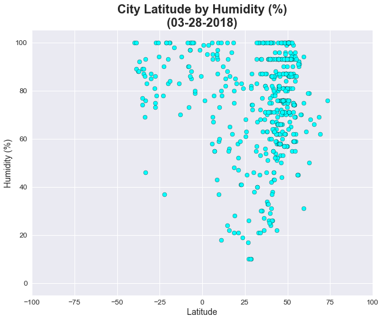

<b><u>Observations</b></u>
<p>1. My data is skewed towards cities in the northern hemisphere (i.e., positive latitudes).  This isn't unusual since the vast majority of the global population is above the equater, but it's clear that there are way more dots on the right hand side of each chart than the left hand side.</p>
<p>2. In looking around +50 degrees latitude, there is a cluster of cities with ~70-90% humidity.  Outside of that, humidity levels were fairly dispersed across cities.</p>
<p>3. The trend for humidity described above is also similar for wind speed.  There is a bunch of of cities around +50 degrees latitude that have a wind speed between 0-10 mph.  There doesn't seem to be an obvious pattern for cities below +50 degrees latitude.</p>

I'm curious to see what trends would emerge if I used a much larger sample size or if I ran this script a few dozen times and compared the results.</p>


```python
# Dependencies
import numpy as np
import random
import json
import requests
from pprint import pprint
from config import api_key
import pandas as pd
import seaborn as sns
import matplotlib.pyplot as plt

# Wrapper for OpenWeatherMap
# Will use this to view sample JSON API response
import openweathermapy.core as owm

# Dependencies for downloading and uncompressing list of cities from OpenWeatherMap
import urllib.request
import gzip

# Set the seaborn chart style
sns.set()

# Increase the size of the scatter plots
plt.rcParams["figure.figsize"] = [10,8]
```


```python
# Print out a sample JSON API response
settings = {"units": "imperial", "appid": api_key}
pprint(owm.get_current(2172797, **settings))
```

    {'base': 'stations',
     'clouds': {'all': 75},
     'cod': 200,
     'coord': {'lat': -16.92, 'lon': 145.77},
     'dt': 1522018800,
     'id': 2172797,
     'main': {'humidity': 88,
              'pressure': 1005,
              'temp': 78.8,
              'temp_max': 78.8,
              'temp_min': 78.8},
     'name': 'Cairns',
     'sys': {'country': 'AU',
             'id': 8166,
             'message': 0.0035,
             'sunrise': 1521922906,
             'sunset': 1521966203,
             'type': 1},
     'visibility': 10000,
     'weather': [{'description': 'shower rain',
                  'icon': '09n',
                  'id': 521,
                  'main': 'Rain'}],
     'wind': {'deg': 160, 'speed': 8.05}}
    

<h1>Download City List</h1>


```python
# This section downloads the list of cities and IDs that OpenWeatherMap uses from their website
# Decided this was more efficient than creating a list of cities using citipy and 
#   latitudes/longitudes since OpenWeatherMap says results will be more accurate if you use IDs instead of names

# File names
city_index_zip_file = "city.list.json.gz"
city_index_json_file = 'city.list.json'

# Download file
urllib.request.urlretrieve ("http://bulk.openweathermap.org/sample/city.list.json.gz", city_index_zip_file)

# Uncompress gzip file to json
inF = gzip.open(city_index_zip_file, 'rb')
outF = open(city_index_json_file, 'wb')
outF.write(inF.read())
inF.close()
outF.close()

# Read json file into a dataframe
city_index_df = pd.read_json(city_index_json_file)

# Print top five rows
city_index_df.head()
```


<div>
<style>
    .dataframe thead tr:only-child th {
        text-align: right;
    }

    .dataframe thead th {
        text-align: left;
    }

    .dataframe tbody tr th {
        vertical-align: top;
    }
</style>
<table border="1" class="dataframe">
  <thead>
    <tr style="text-align: right;">
      <th></th>
      <th>coord</th>
      <th>country</th>
      <th>id</th>
      <th>name</th>
    </tr>
  </thead>
  <tbody>
    <tr>
      <th>0</th>
      <td>{'lon': 34.283333, 'lat': 44.549999}</td>
      <td>UA</td>
      <td>707860</td>
      <td>Hurzuf</td>
    </tr>
    <tr>
      <th>1</th>
      <td>{'lon': 37.666668, 'lat': 55.683334}</td>
      <td>RU</td>
      <td>519188</td>
      <td>Novinki</td>
    </tr>
    <tr>
      <th>2</th>
      <td>{'lon': 84.633331, 'lat': 28}</td>
      <td>NP</td>
      <td>1283378</td>
      <td>Gorkh�</td>
    </tr>
    <tr>
      <th>3</th>
      <td>{'lon': 76, 'lat': 29}</td>
      <td>IN</td>
      <td>1270260</td>
      <td>State of Hary�na</td>
    </tr>
    <tr>
      <th>4</th>
      <td>{'lon': 33.900002, 'lat': 44.599998}</td>
      <td>UA</td>
      <td>708546</td>
      <td>Holubynka</td>
    </tr>
  </tbody>
</table>
</div>


<h1>Generate City List</h1>


```python
# This section selects 555 random cities from the above city index dataframe

# Start by creating an empty dataframe
random_city_df = pd.DataFrame(columns=['coord', 'country', 'id', 'name', 'lon', 'lat'])

# Set counter to zero for looping
counter = 0

# Set total number of random cities
total_cities = 555

# Loop while counter is less than number of cities
while counter < total_cities:
    
    # Pick a random row (must be length - 1 since row starts at 0)
    row = random.randint(0, len(city_index_df)-1)
    
    # If ID is already in the dataframe then do nothing and repeat loop
    if any(random_city_df.id == city_index_df['id'][row]):
        pass
    
    # If ID isn't in the dataframe then add that row to the dataframe, including latitude and longitude
    else:
        random_city_df.loc[counter] = city_index_df.iloc[row,:]
        random_city_df.lat[counter] = city_index_df['coord'][row]['lat']
        random_city_df.lon[counter] = city_index_df['coord'][row]['lon']
        counter = counter + 1
        
# Change latitude and longitude columns from object to float
random_city_df[['lat','lon']] = random_city_df[['lat','lon']].apply(pd.to_numeric)
```

<h1>Weather API Call</h1>


```python
# This section does the API calls from OpenWeatherMap

# Create empty lists for temperature, humidity, cloudiness and windspeed
# This will get added to the dataframe of cities
city_temp_list = []
city_humidity_list = []
city_cloudiness_list = []
city_windspeed_list = []

# Loop through the total number of cities
for index in range(total_cities):
    
    # Print out 
    print(f"Request {index+1} of {total_cities}: {random_city_df['name'][index]}")
    
    # Create the URL
    url = "http://api.openweathermap.org/data/2.5/weather?APPID="+api_key+"&units=imperial&id="+str(random_city_df.id[index])
    
    # Print the URl but mask the api key
    print("http://api.openweathermap.org/data/2.5/weather?APPID=xxxxx&units=imperial&id="+str(random_city_df.id[index]))

    # Do the API call
    response = requests.get(url)
    
    # Convert API response to JSON
    data = response.json()
    
    # Grab temperature, humidity, cloudiness and windspeed and add it to their respective list    
    city_temp_list.append(data['main']['temp'])
    city_humidity_list.append(data['main']['humidity'])
    city_cloudiness_list.append(data['clouds']['all'])
    city_windspeed_list.append(data['wind']['speed'])

# Add temperature, humidity, cloudiness and windspeed as a column in the dataframe
random_city_df['temp'] = city_temp_list
random_city_df['humidity'] = city_humidity_list
random_city_df['cloudiness'] = city_cloudiness_list
random_city_df['windspeed'] = city_windspeed_list
```

    Request 1 of 555: Tembalang
    http://api.openweathermap.org/data/2.5/weather?APPID=xxxxx&units=imperial&id=7035295
    Request 2 of 555: Farvagny-le-Grand
    http://api.openweathermap.org/data/2.5/weather?APPID=xxxxx&units=imperial&id=2660818
    Request 3 of 555: Feusisberg
    http://api.openweathermap.org/data/2.5/weather?APPID=xxxxx&units=imperial&id=7285816
    Request 4 of 555: La Playona
    http://api.openweathermap.org/data/2.5/weather?APPID=xxxxx&units=imperial&id=3607146
    Request 5 of 555: Naples Park
    http://api.openweathermap.org/data/2.5/weather?APPID=xxxxx&units=imperial&id=4165576
    Request 6 of 555: Rollingwood
    http://api.openweathermap.org/data/2.5/weather?APPID=xxxxx&units=imperial&id=5388611
    Request 7 of 555: Saint-Joseph-de-Rivière
    http://api.openweathermap.org/data/2.5/weather?APPID=xxxxx&units=imperial&id=6433355
    Request 8 of 555: Lieboch
    http://api.openweathermap.org/data/2.5/weather?APPID=xxxxx&units=imperial&id=7873406
    Request 9 of 555: Weitersbach
    http://api.openweathermap.org/data/2.5/weather?APPID=xxxxx&units=imperial&id=6553651
    Request 10 of 555: Zmeinogorsk
    http://api.openweathermap.org/data/2.5/weather?APPID=xxxxx&units=imperial&id=1485042
    Request 11 of 555: Dúbravka
    http://api.openweathermap.org/data/2.5/weather?APPID=xxxxx&units=imperial&id=3060322
    Request 12 of 555: Kelcyre
    http://api.openweathermap.org/data/2.5/weather?APPID=xxxxx&units=imperial&id=782843
    Request 13 of 555: Tabonuea Village
    http://api.openweathermap.org/data/2.5/weather?APPID=xxxxx&units=imperial&id=2110099
    Request 14 of 555: Gerstetten
    http://api.openweathermap.org/data/2.5/weather?APPID=xxxxx&units=imperial&id=6555568
    Request 15 of 555: Noord-Scharwoude
    http://api.openweathermap.org/data/2.5/weather?APPID=xxxxx&units=imperial&id=2749835
    Request 16 of 555: Taichung
    http://api.openweathermap.org/data/2.5/weather?APPID=xxxxx&units=imperial&id=1668399
    Request 17 of 555: Buti
    http://api.openweathermap.org/data/2.5/weather?APPID=xxxxx&units=imperial&id=3181351
    Request 18 of 555: Dahu
    http://api.openweathermap.org/data/2.5/weather?APPID=xxxxx&units=imperial&id=1814288
    Request 19 of 555: Larchamp
    http://api.openweathermap.org/data/2.5/weather?APPID=xxxxx&units=imperial&id=3007044
    Request 20 of 555: Villa Urquiza
    http://api.openweathermap.org/data/2.5/weather?APPID=xxxxx&units=imperial&id=3433775
    Request 21 of 555: Hopetoun
    http://api.openweathermap.org/data/2.5/weather?APPID=xxxxx&units=imperial&id=2163168
    Request 22 of 555: El Paisnal
    http://api.openweathermap.org/data/2.5/weather?APPID=xxxxx&units=imperial&id=3586204
    Request 23 of 555: Pie de la Cuesta
    http://api.openweathermap.org/data/2.5/weather?APPID=xxxxx&units=imperial&id=3521553
    Request 24 of 555: Divotino
    http://api.openweathermap.org/data/2.5/weather?APPID=xxxxx&units=imperial&id=6459176
    Request 25 of 555: Tighenif
    http://api.openweathermap.org/data/2.5/weather?APPID=xxxxx&units=imperial&id=2476700
    Request 26 of 555: Oppeide
    http://api.openweathermap.org/data/2.5/weather?APPID=xxxxx&units=imperial&id=7626399
    Request 27 of 555: Unterviehhausen
    http://api.openweathermap.org/data/2.5/weather?APPID=xxxxx&units=imperial&id=2818504
    Request 28 of 555: Hengshui
    http://api.openweathermap.org/data/2.5/weather?APPID=xxxxx&units=imperial&id=1808392
    Request 29 of 555: Krugersdorp West
    http://api.openweathermap.org/data/2.5/weather?APPID=xxxxx&units=imperial&id=986820
    Request 30 of 555: Pendolo
    http://api.openweathermap.org/data/2.5/weather?APPID=xxxxx&units=imperial&id=1631552
    Request 31 of 555: Charnay-les-Macon
    http://api.openweathermap.org/data/2.5/weather?APPID=xxxxx&units=imperial&id=3026534
    Request 32 of 555: Saint-Martin-d'Aubigny
    http://api.openweathermap.org/data/2.5/weather?APPID=xxxxx&units=imperial&id=6435614
    Request 33 of 555: Frederickton
    http://api.openweathermap.org/data/2.5/weather?APPID=xxxxx&units=imperial&id=2166113
    Request 34 of 555: Neuss
    http://api.openweathermap.org/data/2.5/weather?APPID=xxxxx&units=imperial&id=2864118
    Request 35 of 555: Lockeport
    http://api.openweathermap.org/data/2.5/weather?APPID=xxxxx&units=imperial&id=6058237
    Request 36 of 555: Lockwisch
    http://api.openweathermap.org/data/2.5/weather?APPID=xxxxx&units=imperial&id=2876523
    Request 37 of 555: Fort Hancock
    http://api.openweathermap.org/data/2.5/weather?APPID=xxxxx&units=imperial&id=5521724
    Request 38 of 555: Black Lick
    http://api.openweathermap.org/data/2.5/weather?APPID=xxxxx&units=imperial&id=5180709
    Request 39 of 555: Clara
    http://api.openweathermap.org/data/2.5/weather?APPID=xxxxx&units=imperial&id=681343
    Request 40 of 555: Amnat Charoen
    http://api.openweathermap.org/data/2.5/weather?APPID=xxxxx&units=imperial&id=1621060
    Request 41 of 555: Hohenhameln
    http://api.openweathermap.org/data/2.5/weather?APPID=xxxxx&units=imperial&id=2901731
    Request 42 of 555: Grave
    http://api.openweathermap.org/data/2.5/weather?APPID=xxxxx&units=imperial&id=2755358
    Request 43 of 555: Sogod
    http://api.openweathermap.org/data/2.5/weather?APPID=xxxxx&units=imperial&id=1685915
    Request 44 of 555: Tàrrega
    http://api.openweathermap.org/data/2.5/weather?APPID=xxxxx&units=imperial&id=6358945
    Request 45 of 555: Brampton
    http://api.openweathermap.org/data/2.5/weather?APPID=xxxxx&units=imperial&id=2654919
    Request 46 of 555: Park Place
    http://api.openweathermap.org/data/2.5/weather?APPID=xxxxx&units=imperial&id=5205105
    Request 47 of 555: Lillard Park
    http://api.openweathermap.org/data/2.5/weather?APPID=xxxxx&units=imperial&id=4541040
    Request 48 of 555: Abezames
    http://api.openweathermap.org/data/2.5/weather?APPID=xxxxx&units=imperial&id=6362449
    Request 49 of 555: Queige
    http://api.openweathermap.org/data/2.5/weather?APPID=xxxxx&units=imperial&id=2984848
    Request 50 of 555: Shuto Orizari
    http://api.openweathermap.org/data/2.5/weather?APPID=xxxxx&units=imperial&id=833258
    Request 51 of 555: Balestrate
    http://api.openweathermap.org/data/2.5/weather?APPID=xxxxx&units=imperial&id=2525609
    Request 52 of 555: Échirolles
    http://api.openweathermap.org/data/2.5/weather?APPID=xxxxx&units=imperial&id=6433192
    Request 53 of 555: Waupun
    http://api.openweathermap.org/data/2.5/weather?APPID=xxxxx&units=imperial&id=5278106
    Request 54 of 555: Fiskdale
    http://api.openweathermap.org/data/2.5/weather?APPID=xxxxx&units=imperial&id=4936792
    Request 55 of 555: San Luis
    http://api.openweathermap.org/data/2.5/weather?APPID=xxxxx&units=imperial&id=3601932
    Request 56 of 555: Kholzanovo
    http://api.openweathermap.org/data/2.5/weather?APPID=xxxxx&units=imperial&id=2022365
    Request 57 of 555: Campanario
    http://api.openweathermap.org/data/2.5/weather?APPID=xxxxx&units=imperial&id=6355893
    Request 58 of 555: Emu Park
    http://api.openweathermap.org/data/2.5/weather?APPID=xxxxx&units=imperial&id=2167333
    Request 59 of 555: Innbygda
    http://api.openweathermap.org/data/2.5/weather?APPID=xxxxx&units=imperial&id=3133819
    Request 60 of 555: San Pietro Val Lemina
    http://api.openweathermap.org/data/2.5/weather?APPID=xxxxx&units=imperial&id=6543787
    Request 61 of 555: Bonilla de la Sierra
    http://api.openweathermap.org/data/2.5/weather?APPID=xxxxx&units=imperial&id=3127839
    Request 62 of 555: Ardeoani
    http://api.openweathermap.org/data/2.5/weather?APPID=xxxxx&units=imperial&id=686212
    Request 63 of 555: Melle
    http://api.openweathermap.org/data/2.5/weather?APPID=xxxxx&units=imperial&id=2872079
    Request 64 of 555: Lapao
    http://api.openweathermap.org/data/2.5/weather?APPID=xxxxx&units=imperial&id=3458817
    Request 65 of 555: Coolac
    http://api.openweathermap.org/data/2.5/weather?APPID=xxxxx&units=imperial&id=2170648
    Request 66 of 555: Banjar
    http://api.openweathermap.org/data/2.5/weather?APPID=xxxxx&units=imperial&id=8143791
    Request 67 of 555: Taszar
    http://api.openweathermap.org/data/2.5/weather?APPID=xxxxx&units=imperial&id=3044088
    Request 68 of 555: Great Coates
    http://api.openweathermap.org/data/2.5/weather?APPID=xxxxx&units=imperial&id=2648133
    Request 69 of 555: Aqadyr
    http://api.openweathermap.org/data/2.5/weather?APPID=xxxxx&units=imperial&id=1526274
    Request 70 of 555: Kostryzhivka
    http://api.openweathermap.org/data/2.5/weather?APPID=xxxxx&units=imperial&id=704730
    Request 71 of 555: Saint-Peray
    http://api.openweathermap.org/data/2.5/weather?APPID=xxxxx&units=imperial&id=2977623
    Request 72 of 555: Dichiseni
    http://api.openweathermap.org/data/2.5/weather?APPID=xxxxx&units=imperial&id=679428
    Request 73 of 555: Lengronne
    http://api.openweathermap.org/data/2.5/weather?APPID=xxxxx&units=imperial&id=3003119
    Request 74 of 555: Copanatoyac
    http://api.openweathermap.org/data/2.5/weather?APPID=xxxxx&units=imperial&id=3530254
    Request 75 of 555: Luis Moya
    http://api.openweathermap.org/data/2.5/weather?APPID=xxxxx&units=imperial&id=3997017
    Request 76 of 555: Tschernitz
    http://api.openweathermap.org/data/2.5/weather?APPID=xxxxx&units=imperial&id=2820624
    Request 77 of 555: Margate City
    http://api.openweathermap.org/data/2.5/weather?APPID=xxxxx&units=imperial&id=4502904
    Request 78 of 555: Saint-Jean-de-Gonville
    http://api.openweathermap.org/data/2.5/weather?APPID=xxxxx&units=imperial&id=2979326
    Request 79 of 555: Bickley
    http://api.openweathermap.org/data/2.5/weather?APPID=xxxxx&units=imperial&id=2076674
    Request 80 of 555: Luzzi
    http://api.openweathermap.org/data/2.5/weather?APPID=xxxxx&units=imperial&id=6537671
    Request 81 of 555: Quevedo
    http://api.openweathermap.org/data/2.5/weather?APPID=xxxxx&units=imperial&id=3652567
    Request 82 of 555: Glebovo
    http://api.openweathermap.org/data/2.5/weather?APPID=xxxxx&units=imperial&id=561278
    Request 83 of 555: Richland Hills
    http://api.openweathermap.org/data/2.5/weather?APPID=xxxxx&units=imperial&id=4722668
    Request 84 of 555: Kamphaeng Saen
    http://api.openweathermap.org/data/2.5/weather?APPID=xxxxx&units=imperial&id=1610445
    Request 85 of 555: Willow Tree
    http://api.openweathermap.org/data/2.5/weather?APPID=xxxxx&units=imperial&id=2143536
    Request 86 of 555: Bezirk Brugg
    http://api.openweathermap.org/data/2.5/weather?APPID=xxxxx&units=imperial&id=6458826
    Request 87 of 555: Rothenburg
    http://api.openweathermap.org/data/2.5/weather?APPID=xxxxx&units=imperial&id=6549182
    Request 88 of 555: Arrifana
    http://api.openweathermap.org/data/2.5/weather?APPID=xxxxx&units=imperial&id=8011907
    Request 89 of 555: Vouziers
    http://api.openweathermap.org/data/2.5/weather?APPID=xxxxx&units=imperial&id=6453604
    Request 90 of 555: Selagalas
    http://api.openweathermap.org/data/2.5/weather?APPID=xxxxx&units=imperial&id=7335813
    Request 91 of 555: Mezőssytanya
    http://api.openweathermap.org/data/2.5/weather?APPID=xxxxx&units=imperial&id=3048096
    Request 92 of 555: Naranjal
    http://api.openweathermap.org/data/2.5/weather?APPID=xxxxx&units=imperial&id=3437689
    Request 93 of 555: Haslingfield
    http://api.openweathermap.org/data/2.5/weather?APPID=xxxxx&units=imperial&id=2647362
    Request 94 of 555: Insingen
    http://api.openweathermap.org/data/2.5/weather?APPID=xxxxx&units=imperial&id=6556843
    Request 95 of 555: Darakert
    http://api.openweathermap.org/data/2.5/weather?APPID=xxxxx&units=imperial&id=823811
    Request 96 of 555: Nossa Senhora do Socorro
    http://api.openweathermap.org/data/2.5/weather?APPID=xxxxx&units=imperial&id=3456223
    Request 97 of 555: Festubert
    http://api.openweathermap.org/data/2.5/weather?APPID=xxxxx&units=imperial&id=3018591
    Request 98 of 555: Orcutt
    http://api.openweathermap.org/data/2.5/weather?APPID=xxxxx&units=imperial&id=5379609
    Request 99 of 555: Parva
    http://api.openweathermap.org/data/2.5/weather?APPID=xxxxx&units=imperial&id=671311
    Request 100 of 555: Helegiu
    http://api.openweathermap.org/data/2.5/weather?APPID=xxxxx&units=imperial&id=676262
    Request 101 of 555: Sao Goncalo do Amarante
    http://api.openweathermap.org/data/2.5/weather?APPID=xxxxx&units=imperial&id=3388713
    Request 102 of 555: Cikadu
    http://api.openweathermap.org/data/2.5/weather?APPID=xxxxx&units=imperial&id=7915091
    Request 103 of 555: Potsdam
    http://api.openweathermap.org/data/2.5/weather?APPID=xxxxx&units=imperial&id=7116850
    Request 104 of 555: Ellhoft
    http://api.openweathermap.org/data/2.5/weather?APPID=xxxxx&units=imperial&id=2930946
    Request 105 of 555: State of Uttarakhand
    http://api.openweathermap.org/data/2.5/weather?APPID=xxxxx&units=imperial&id=1444366
    Request 106 of 555: Witsum
    http://api.openweathermap.org/data/2.5/weather?APPID=xxxxx&units=imperial&id=2807395
    Request 107 of 555: Fuentearmegil
    http://api.openweathermap.org/data/2.5/weather?APPID=xxxxx&units=imperial&id=3121950
    Request 108 of 555: Riola Sardo
    http://api.openweathermap.org/data/2.5/weather?APPID=xxxxx&units=imperial&id=2523613
    Request 109 of 555: Cihaur
    http://api.openweathermap.org/data/2.5/weather?APPID=xxxxx&units=imperial&id=7858500
    Request 110 of 555: Gadung
    http://api.openweathermap.org/data/2.5/weather?APPID=xxxxx&units=imperial&id=1713413
    Request 111 of 555: Clairoix
    http://api.openweathermap.org/data/2.5/weather?APPID=xxxxx&units=imperial&id=3024801
    Request 112 of 555: Pedrola
    http://api.openweathermap.org/data/2.5/weather?APPID=xxxxx&units=imperial&id=6362891
    Request 113 of 555: Dindori
    http://api.openweathermap.org/data/2.5/weather?APPID=xxxxx&units=imperial&id=1272540
    Request 114 of 555: Farasan
    http://api.openweathermap.org/data/2.5/weather?APPID=xxxxx&units=imperial&id=106744
    Request 115 of 555: Phonphisai
    http://api.openweathermap.org/data/2.5/weather?APPID=xxxxx&units=imperial&id=7510984
    Request 116 of 555: Miravet
    http://api.openweathermap.org/data/2.5/weather?APPID=xxxxx&units=imperial&id=3116678
    Request 117 of 555: Castello de Rugat
    http://api.openweathermap.org/data/2.5/weather?APPID=xxxxx&units=imperial&id=2519751
    Request 118 of 555: La Huelga
    http://api.openweathermap.org/data/2.5/weather?APPID=xxxxx&units=imperial&id=2515869
    Request 119 of 555: Redwood County
    http://api.openweathermap.org/data/2.5/weather?APPID=xxxxx&units=imperial&id=5042847
    Request 120 of 555: Agana Heights Village
    http://api.openweathermap.org/data/2.5/weather?APPID=xxxxx&units=imperial&id=4043525
    Request 121 of 555: Murshidabad
    http://api.openweathermap.org/data/2.5/weather?APPID=xxxxx&units=imperial&id=1262412
    Request 122 of 555: Hasselbach
    http://api.openweathermap.org/data/2.5/weather?APPID=xxxxx&units=imperial&id=2909433
    Request 123 of 555: East Syracuse
    http://api.openweathermap.org/data/2.5/weather?APPID=xxxxx&units=imperial&id=5116079
    Request 124 of 555: Perleberg
    http://api.openweathermap.org/data/2.5/weather?APPID=xxxxx&units=imperial&id=2854848
    Request 125 of 555: Khantau
    http://api.openweathermap.org/data/2.5/weather?APPID=xxxxx&units=imperial&id=1522714
    Request 126 of 555: Opiyai
    http://api.openweathermap.org/data/2.5/weather?APPID=xxxxx&units=imperial&id=226975
    Request 127 of 555: Caxito
    http://api.openweathermap.org/data/2.5/weather?APPID=xxxxx&units=imperial&id=2242001
    Request 128 of 555: Saowi
    http://api.openweathermap.org/data/2.5/weather?APPID=xxxxx&units=imperial&id=1628692
    Request 129 of 555: Maisonnettes
    http://api.openweathermap.org/data/2.5/weather?APPID=xxxxx&units=imperial&id=2996588
    Request 130 of 555: Umuquena
    http://api.openweathermap.org/data/2.5/weather?APPID=xxxxx&units=imperial&id=3625732
    Request 131 of 555: Ossi
    http://api.openweathermap.org/data/2.5/weather?APPID=xxxxx&units=imperial&id=3171814
    Request 132 of 555: Newquay
    http://api.openweathermap.org/data/2.5/weather?APPID=xxxxx&units=imperial&id=2641589
    Request 133 of 555: Touying
    http://api.openweathermap.org/data/2.5/weather?APPID=xxxxx&units=imperial&id=1792485
    Request 134 of 555: Bruges
    http://api.openweathermap.org/data/2.5/weather?APPID=xxxxx&units=imperial&id=6614135
    Request 135 of 555: Platten
    http://api.openweathermap.org/data/2.5/weather?APPID=xxxxx&units=imperial&id=6554366
    Request 136 of 555: Gross Bornecke
    http://api.openweathermap.org/data/2.5/weather?APPID=xxxxx&units=imperial&id=2916942
    Request 137 of 555: Canda
    http://api.openweathermap.org/data/2.5/weather?APPID=xxxxx&units=imperial&id=6535596
    Request 138 of 555: Busquistar
    http://api.openweathermap.org/data/2.5/weather?APPID=xxxxx&units=imperial&id=2520697
    Request 139 of 555: Fresno de Caracena
    http://api.openweathermap.org/data/2.5/weather?APPID=xxxxx&units=imperial&id=3122036
    Request 140 of 555: Winnipeg
    http://api.openweathermap.org/data/2.5/weather?APPID=xxxxx&units=imperial&id=6183235
    Request 141 of 555: Debe Wielkie
    http://api.openweathermap.org/data/2.5/weather?APPID=xxxxx&units=imperial&id=773386
    Request 142 of 555: Schmorda
    http://api.openweathermap.org/data/2.5/weather?APPID=xxxxx&units=imperial&id=6550471
    Request 143 of 555: Arganil
    http://api.openweathermap.org/data/2.5/weather?APPID=xxxxx&units=imperial&id=8011757
    Request 144 of 555: Nginda
    http://api.openweathermap.org/data/2.5/weather?APPID=xxxxx&units=imperial&id=183689
    Request 145 of 555: Martos
    http://api.openweathermap.org/data/2.5/weather?APPID=xxxxx&units=imperial&id=6358510
    Request 146 of 555: Zhaopu
    http://api.openweathermap.org/data/2.5/weather?APPID=xxxxx&units=imperial&id=6824158
    Request 147 of 555: El Pescado
    http://api.openweathermap.org/data/2.5/weather?APPID=xxxxx&units=imperial&id=4008636
    Request 148 of 555: West Pensacola
    http://api.openweathermap.org/data/2.5/weather?APPID=xxxxx&units=imperial&id=4177908
    Request 149 of 555: Sankt Georgen am Walde
    http://api.openweathermap.org/data/2.5/weather?APPID=xxxxx&units=imperial&id=7871067
    Request 150 of 555: Dinant
    http://api.openweathermap.org/data/2.5/weather?APPID=xxxxx&units=imperial&id=2799359
    Request 151 of 555: Zolotnikovskaya Pustyn’
    http://api.openweathermap.org/data/2.5/weather?APPID=xxxxx&units=imperial&id=462197
    Request 152 of 555: Carrick-on-Shannon
    http://api.openweathermap.org/data/2.5/weather?APPID=xxxxx&units=imperial&id=2965727
    Request 153 of 555: Pôrto Novo
    http://api.openweathermap.org/data/2.5/weather?APPID=xxxxx&units=imperial&id=3452702
    Request 154 of 555: Itzstedt
    http://api.openweathermap.org/data/2.5/weather?APPID=xxxxx&units=imperial&id=2895552
    Request 155 of 555: Hauenstein
    http://api.openweathermap.org/data/2.5/weather?APPID=xxxxx&units=imperial&id=6555324
    Request 156 of 555: Waldport
    http://api.openweathermap.org/data/2.5/weather?APPID=xxxxx&units=imperial&id=5758901
    Request 157 of 555: Posëlok Neftebazy
    http://api.openweathermap.org/data/2.5/weather?APPID=xxxxx&units=imperial&id=6417711
    Request 158 of 555: Atsimo-Andrefana
    http://api.openweathermap.org/data/2.5/weather?APPID=xxxxx&units=imperial&id=7670913
    Request 159 of 555: Aojiang
    http://api.openweathermap.org/data/2.5/weather?APPID=xxxxx&units=imperial&id=1916294
    Request 160 of 555: Sizun
    http://api.openweathermap.org/data/2.5/weather?APPID=xxxxx&units=imperial&id=6453937
    Request 161 of 555: Forshaga
    http://api.openweathermap.org/data/2.5/weather?APPID=xxxxx&units=imperial&id=2713971
    Request 162 of 555: Nestelbach bei Graz
    http://api.openweathermap.org/data/2.5/weather?APPID=xxxxx&units=imperial&id=2770874
    Request 163 of 555: Saint-Denis-de-Mailloc
    http://api.openweathermap.org/data/2.5/weather?APPID=xxxxx&units=imperial&id=6427426
    Request 164 of 555: Kishi
    http://api.openweathermap.org/data/2.5/weather?APPID=xxxxx&units=imperial&id=2334327
    Request 165 of 555: Safipur
    http://api.openweathermap.org/data/2.5/weather?APPID=xxxxx&units=imperial&id=1257854
    Request 166 of 555: Wonosari
    http://api.openweathermap.org/data/2.5/weather?APPID=xxxxx&units=imperial&id=2002872
    Request 167 of 555: Uchoa
    http://api.openweathermap.org/data/2.5/weather?APPID=xxxxx&units=imperial&id=3445824
    Request 168 of 555: Powiat pucki
    http://api.openweathermap.org/data/2.5/weather?APPID=xxxxx&units=imperial&id=7530788
    Request 169 of 555: Sami
    http://api.openweathermap.org/data/2.5/weather?APPID=xxxxx&units=imperial&id=2412199
    Request 170 of 555: Berg
    http://api.openweathermap.org/data/2.5/weather?APPID=xxxxx&units=imperial&id=2950749
    Request 171 of 555: Cândido Godói
    http://api.openweathermap.org/data/2.5/weather?APPID=xxxxx&units=imperial&id=3467543
    Request 172 of 555: Paterson
    http://api.openweathermap.org/data/2.5/weather?APPID=xxxxx&units=imperial&id=5102466
    Request 173 of 555: Snippeling
    http://api.openweathermap.org/data/2.5/weather?APPID=xxxxx&units=imperial&id=2747046
    Request 174 of 555: Dingalan
    http://api.openweathermap.org/data/2.5/weather?APPID=xxxxx&units=imperial&id=1714743
    Request 175 of 555: Sicong
    http://api.openweathermap.org/data/2.5/weather?APPID=xxxxx&units=imperial&id=8201761
    Request 176 of 555: Winkelheim
    http://api.openweathermap.org/data/2.5/weather?APPID=xxxxx&units=imperial&id=2807984
    Request 177 of 555: Baakwoning
    http://api.openweathermap.org/data/2.5/weather?APPID=xxxxx&units=imperial&id=6544755
    Request 178 of 555: Ardara
    http://api.openweathermap.org/data/2.5/weather?APPID=xxxxx&units=imperial&id=2966935
    Request 179 of 555: Glushni
    http://api.openweathermap.org/data/2.5/weather?APPID=xxxxx&units=imperial&id=7093847
    Request 180 of 555: Grub
    http://api.openweathermap.org/data/2.5/weather?APPID=xxxxx&units=imperial&id=2914661
    Request 181 of 555: Vienne-en-Val
    http://api.openweathermap.org/data/2.5/weather?APPID=xxxxx&units=imperial&id=6434754
    Request 182 of 555: Neila
    http://api.openweathermap.org/data/2.5/weather?APPID=xxxxx&units=imperial&id=3115508
    Request 183 of 555: Chexbres
    http://api.openweathermap.org/data/2.5/weather?APPID=xxxxx&units=imperial&id=7285507
    Request 184 of 555: Retzerheide
    http://api.openweathermap.org/data/2.5/weather?APPID=xxxxx&units=imperial&id=2847951
    Request 185 of 555: Hamilton
    http://api.openweathermap.org/data/2.5/weather?APPID=xxxxx&units=imperial&id=5969782
    Request 186 of 555: Epfenbach
    http://api.openweathermap.org/data/2.5/weather?APPID=xxxxx&units=imperial&id=2929873
    Request 187 of 555: Wasenstein
    http://api.openweathermap.org/data/2.5/weather?APPID=xxxxx&units=imperial&id=2813801
    Request 188 of 555: Diyag
    http://api.openweathermap.org/data/2.5/weather?APPID=xxxxx&units=imperial&id=7927587
    Request 189 of 555: Lebrija
    http://api.openweathermap.org/data/2.5/weather?APPID=xxxxx&units=imperial&id=2515096
    Request 190 of 555: Partapur
    http://api.openweathermap.org/data/2.5/weather?APPID=xxxxx&units=imperial&id=1260232
    Request 191 of 555: Villa di Briano
    http://api.openweathermap.org/data/2.5/weather?APPID=xxxxx&units=imperial&id=6535630
    Request 192 of 555: Sanvordem
    http://api.openweathermap.org/data/2.5/weather?APPID=xxxxx&units=imperial&id=1257316
    Request 193 of 555: Cairo
    http://api.openweathermap.org/data/2.5/weather?APPID=xxxxx&units=imperial&id=4104031
    Request 194 of 555: San Julián
    http://api.openweathermap.org/data/2.5/weather?APPID=xxxxx&units=imperial&id=3110509
    Request 195 of 555: Pandacaqui
    http://api.openweathermap.org/data/2.5/weather?APPID=xxxxx&units=imperial&id=1695583
    Request 196 of 555: Koppies
    http://api.openweathermap.org/data/2.5/weather?APPID=xxxxx&units=imperial&id=987875
    Request 197 of 555: Riverside
    http://api.openweathermap.org/data/2.5/weather?APPID=xxxxx&units=imperial&id=4405795
    Request 198 of 555: Orero
    http://api.openweathermap.org/data/2.5/weather?APPID=xxxxx&units=imperial&id=6534384
    Request 199 of 555: San Agustín Altamirano
    http://api.openweathermap.org/data/2.5/weather?APPID=xxxxx&units=imperial&id=3519995
    Request 200 of 555: Filacciano
    http://api.openweathermap.org/data/2.5/weather?APPID=xxxxx&units=imperial&id=3177004
    Request 201 of 555: Galmaarden
    http://api.openweathermap.org/data/2.5/weather?APPID=xxxxx&units=imperial&id=2797851
    Request 202 of 555: Fontenay-de-Bossery
    http://api.openweathermap.org/data/2.5/weather?APPID=xxxxx&units=imperial&id=3017923
    Request 203 of 555: Fuling
    http://api.openweathermap.org/data/2.5/weather?APPID=xxxxx&units=imperial&id=1810980
    Request 204 of 555: Kozle
    http://api.openweathermap.org/data/2.5/weather?APPID=xxxxx&units=imperial&id=3094871
    Request 205 of 555: Al Aliyah
    http://api.openweathermap.org/data/2.5/weather?APPID=xxxxx&units=imperial&id=2473876
    Request 206 of 555: Paraíso do Sul
    http://api.openweathermap.org/data/2.5/weather?APPID=xxxxx&units=imperial&id=3455093
    Request 207 of 555: Mestna Ob�ina Ljubljana
    http://api.openweathermap.org/data/2.5/weather?APPID=xxxxx&units=imperial&id=3239318
    Request 208 of 555: Paducah
    http://api.openweathermap.org/data/2.5/weather?APPID=xxxxx&units=imperial&id=4048662
    Request 209 of 555: Halbweg
    http://api.openweathermap.org/data/2.5/weather?APPID=xxxxx&units=imperial&id=2911640
    Request 210 of 555: Calabrez
    http://api.openweathermap.org/data/2.5/weather?APPID=xxxxx&units=imperial&id=3127073
    Request 211 of 555: Racovita
    http://api.openweathermap.org/data/2.5/weather?APPID=xxxxx&units=imperial&id=669323
    Request 212 of 555: Santana de Cataguases
    http://api.openweathermap.org/data/2.5/weather?APPID=xxxxx&units=imperial&id=3449950
    Request 213 of 555: Quinquis
    http://api.openweathermap.org/data/2.5/weather?APPID=xxxxx&units=imperial&id=2984671
    Request 214 of 555: Leander
    http://api.openweathermap.org/data/2.5/weather?APPID=xxxxx&units=imperial&id=4705708
    Request 215 of 555: Hosingen
    http://api.openweathermap.org/data/2.5/weather?APPID=xxxxx&units=imperial&id=6693300
    Request 216 of 555: Mount Sterling
    http://api.openweathermap.org/data/2.5/weather?APPID=xxxxx&units=imperial&id=4245136
    Request 217 of 555: San Julian
    http://api.openweathermap.org/data/2.5/weather?APPID=xxxxx&units=imperial&id=3985797
    Request 218 of 555: Montalbo
    http://api.openweathermap.org/data/2.5/weather?APPID=xxxxx&units=imperial&id=2513667
    Request 219 of 555: Cherokee
    http://api.openweathermap.org/data/2.5/weather?APPID=xxxxx&units=imperial&id=4851247
    Request 220 of 555: Dimos Samos
    http://api.openweathermap.org/data/2.5/weather?APPID=xxxxx&units=imperial&id=8133749
    Request 221 of 555: Maradékdűlő
    http://api.openweathermap.org/data/2.5/weather?APPID=xxxxx&units=imperial&id=717844
    Request 222 of 555: Aroma
    http://api.openweathermap.org/data/2.5/weather?APPID=xxxxx&units=imperial&id=378502
    Request 223 of 555: Vrbas
    http://api.openweathermap.org/data/2.5/weather?APPID=xxxxx&units=imperial&id=3187297
    Request 224 of 555: Herrera de los Navarros
    http://api.openweathermap.org/data/2.5/weather?APPID=xxxxx&units=imperial&id=6362814
    Request 225 of 555: Emirdag
    http://api.openweathermap.org/data/2.5/weather?APPID=xxxxx&units=imperial&id=315621
    Request 226 of 555: Muhradah
    http://api.openweathermap.org/data/2.5/weather?APPID=xxxxx&units=imperial&id=166742
    Request 227 of 555: Yazykovo
    http://api.openweathermap.org/data/2.5/weather?APPID=xxxxx&units=imperial&id=468483
    Request 228 of 555: Masciago Primo
    http://api.openweathermap.org/data/2.5/weather?APPID=xxxxx&units=imperial&id=6534399
    Request 229 of 555: Buesaco
    http://api.openweathermap.org/data/2.5/weather?APPID=xxxxx&units=imperial&id=3688266
    Request 230 of 555: Malou
    http://api.openweathermap.org/data/2.5/weather?APPID=xxxxx&units=imperial&id=1801330
    Request 231 of 555: Yelovo
    http://api.openweathermap.org/data/2.5/weather?APPID=xxxxx&units=imperial&id=467711
    Request 232 of 555: Emperador
    http://api.openweathermap.org/data/2.5/weather?APPID=xxxxx&units=imperial&id=6361982
    Request 233 of 555: San Vito di Cadore
    http://api.openweathermap.org/data/2.5/weather?APPID=xxxxx&units=imperial&id=3167182
    Request 234 of 555: Burton upon Stather
    http://api.openweathermap.org/data/2.5/weather?APPID=xxxxx&units=imperial&id=2654201
    Request 235 of 555: Larena
    http://api.openweathermap.org/data/2.5/weather?APPID=xxxxx&units=imperial&id=1707223
    Request 236 of 555: Fraize
    http://api.openweathermap.org/data/2.5/weather?APPID=xxxxx&units=imperial&id=3017400
    Request 237 of 555: Kirawsk
    http://api.openweathermap.org/data/2.5/weather?APPID=xxxxx&units=imperial&id=627272
    Request 238 of 555: Tongyuan
    http://api.openweathermap.org/data/2.5/weather?APPID=xxxxx&units=imperial&id=1792529
    Request 239 of 555: Bassillac
    http://api.openweathermap.org/data/2.5/weather?APPID=xxxxx&units=imperial&id=3034665
    Request 240 of 555: Bredeweg
    http://api.openweathermap.org/data/2.5/weather?APPID=xxxxx&units=imperial&id=2758391
    Request 241 of 555: Montemurlo
    http://api.openweathermap.org/data/2.5/weather?APPID=xxxxx&units=imperial&id=6541554
    Request 242 of 555: DeBary
    http://api.openweathermap.org/data/2.5/weather?APPID=xxxxx&units=imperial&id=4152926
    Request 243 of 555: Vernet-la-Varenne
    http://api.openweathermap.org/data/2.5/weather?APPID=xxxxx&units=imperial&id=2969818
    Request 244 of 555: Palmer
    http://api.openweathermap.org/data/2.5/weather?APPID=xxxxx&units=imperial&id=5871146
    Request 245 of 555: Gosseldange
    http://api.openweathermap.org/data/2.5/weather?APPID=xxxxx&units=imperial&id=2960531
    Request 246 of 555: Marktbreit
    http://api.openweathermap.org/data/2.5/weather?APPID=xxxxx&units=imperial&id=2873307
    Request 247 of 555: Ciriza
    http://api.openweathermap.org/data/2.5/weather?APPID=xxxxx&units=imperial&id=3124991
    Request 248 of 555: Sanatoriy Kryms’ke Prymor�ya
    http://api.openweathermap.org/data/2.5/weather?APPID=xxxxx&units=imperial&id=703863
    Request 249 of 555: Saint-Imier
    http://api.openweathermap.org/data/2.5/weather?APPID=xxxxx&units=imperial&id=7287029
    Request 250 of 555: Parentis-en-Born
    http://api.openweathermap.org/data/2.5/weather?APPID=xxxxx&units=imperial&id=6433920
    Request 251 of 555: Lindo
    http://api.openweathermap.org/data/2.5/weather?APPID=xxxxx&units=imperial&id=2694838
    Request 252 of 555: Kulmbach
    http://api.openweathermap.org/data/2.5/weather?APPID=xxxxx&units=imperial&id=2882588
    Request 253 of 555: Cherveix-Cubas
    http://api.openweathermap.org/data/2.5/weather?APPID=xxxxx&units=imperial&id=3025423
    Request 254 of 555: Região Autónoma da Madeira
    http://api.openweathermap.org/data/2.5/weather?APPID=xxxxx&units=imperial&id=2593105
    Request 255 of 555: Sítio Paraná
    http://api.openweathermap.org/data/2.5/weather?APPID=xxxxx&units=imperial&id=3969406
    Request 256 of 555: Remmels
    http://api.openweathermap.org/data/2.5/weather?APPID=xxxxx&units=imperial&id=6551907
    Request 257 of 555: Sanhoane
    http://api.openweathermap.org/data/2.5/weather?APPID=xxxxx&units=imperial&id=2734770
    Request 258 of 555: Menzel
    http://api.openweathermap.org/data/2.5/weather?APPID=xxxxx&units=imperial&id=2871876
    Request 259 of 555: Kostromskaya Oblast’
    http://api.openweathermap.org/data/2.5/weather?APPID=xxxxx&units=imperial&id=543871
    Request 260 of 555: Mtakoudja
    http://api.openweathermap.org/data/2.5/weather?APPID=xxxxx&units=imperial&id=1090583
    Request 261 of 555: Churánov
    http://api.openweathermap.org/data/2.5/weather?APPID=xxxxx&units=imperial&id=3077510
    Request 262 of 555: Nabatiye et Tahta
    http://api.openweathermap.org/data/2.5/weather?APPID=xxxxx&units=imperial&id=278913
    Request 263 of 555: Trikala
    http://api.openweathermap.org/data/2.5/weather?APPID=xxxxx&units=imperial&id=252664
    Request 264 of 555: Gumpoldskirchen
    http://api.openweathermap.org/data/2.5/weather?APPID=xxxxx&units=imperial&id=7872977
    Request 265 of 555: Pul-e Hisar
    http://api.openweathermap.org/data/2.5/weather?APPID=xxxxx&units=imperial&id=1464922
    Request 266 of 555: Zavods’ke
    http://api.openweathermap.org/data/2.5/weather?APPID=xxxxx&units=imperial&id=687501
    Request 267 of 555: Tongtianxiang
    http://api.openweathermap.org/data/2.5/weather?APPID=xxxxx&units=imperial&id=7328962
    Request 268 of 555: Peresecina
    http://api.openweathermap.org/data/2.5/weather?APPID=xxxxx&units=imperial&id=617609
    Request 269 of 555: Svetoch
    http://api.openweathermap.org/data/2.5/weather?APPID=xxxxx&units=imperial&id=485642
    Request 270 of 555: Hiendelaencina
    http://api.openweathermap.org/data/2.5/weather?APPID=xxxxx&units=imperial&id=6357916
    Request 271 of 555: Gubbio
    http://api.openweathermap.org/data/2.5/weather?APPID=xxxxx&units=imperial&id=6541111
    Request 272 of 555: Kleinwelsbach
    http://api.openweathermap.org/data/2.5/weather?APPID=xxxxx&units=imperial&id=2888018
    Request 273 of 555: Wauchope
    http://api.openweathermap.org/data/2.5/weather?APPID=xxxxx&units=imperial&id=2144332
    Request 274 of 555: El Rincon
    http://api.openweathermap.org/data/2.5/weather?APPID=xxxxx&units=imperial&id=3710040
    Request 275 of 555: Asind
    http://api.openweathermap.org/data/2.5/weather?APPID=xxxxx&units=imperial&id=1278278
    Request 276 of 555: Ospedaletto dAlpinolo
    http://api.openweathermap.org/data/2.5/weather?APPID=xxxxx&units=imperial&id=3171830
    Request 277 of 555: Saint-Hilaire-de-Clisson
    http://api.openweathermap.org/data/2.5/weather?APPID=xxxxx&units=imperial&id=2979551
    Request 278 of 555: Margaux
    http://api.openweathermap.org/data/2.5/weather?APPID=xxxxx&units=imperial&id=6432295
    Request 279 of 555: Chavannes-le-Chêne
    http://api.openweathermap.org/data/2.5/weather?APPID=xxxxx&units=imperial&id=2661196
    Request 280 of 555: Sinking Spring
    http://api.openweathermap.org/data/2.5/weather?APPID=xxxxx&units=imperial&id=5212342
    Request 281 of 555: Nortmoor
    http://api.openweathermap.org/data/2.5/weather?APPID=xxxxx&units=imperial&id=2861807
    Request 282 of 555: Pattukkottai
    http://api.openweathermap.org/data/2.5/weather?APPID=xxxxx&units=imperial&id=1260040
    Request 283 of 555: Sarfiraz Kala
    http://api.openweathermap.org/data/2.5/weather?APPID=xxxxx&units=imperial&id=1127001
    Request 284 of 555: Simoes
    http://api.openweathermap.org/data/2.5/weather?APPID=xxxxx&units=imperial&id=3387625
    Request 285 of 555: Obonoma
    http://api.openweathermap.org/data/2.5/weather?APPID=xxxxx&units=imperial&id=2328185
    Request 286 of 555: Chandler
    http://api.openweathermap.org/data/2.5/weather?APPID=xxxxx&units=imperial&id=6943811
    Request 287 of 555: Barraganyatti
    http://api.openweathermap.org/data/2.5/weather?APPID=xxxxx&units=imperial&id=2176759
    Request 288 of 555: Corral de Almaguer
    http://api.openweathermap.org/data/2.5/weather?APPID=xxxxx&units=imperial&id=6361714
    Request 289 of 555: Obshtina Boboshevo
    http://api.openweathermap.org/data/2.5/weather?APPID=xxxxx&units=imperial&id=733152
    Request 290 of 555: Teller
    http://api.openweathermap.org/data/2.5/weather?APPID=xxxxx&units=imperial&id=5875969
    Request 291 of 555: Lincoln Park
    http://api.openweathermap.org/data/2.5/weather?APPID=xxxxx&units=imperial&id=4999311
    Request 292 of 555: Benito
    http://api.openweathermap.org/data/2.5/weather?APPID=xxxxx&units=imperial&id=5898322
    Request 293 of 555: Druya
    http://api.openweathermap.org/data/2.5/weather?APPID=xxxxx&units=imperial&id=628871
    Request 294 of 555: Green Cove Springs
    http://api.openweathermap.org/data/2.5/weather?APPID=xxxxx&units=imperial&id=4157427
    Request 295 of 555: Barpeta Road
    http://api.openweathermap.org/data/2.5/weather?APPID=xxxxx&units=imperial&id=7302849
    Request 296 of 555: Goldswil
    http://api.openweathermap.org/data/2.5/weather?APPID=xxxxx&units=imperial&id=2660570
    Request 297 of 555: Kutoanyar
    http://api.openweathermap.org/data/2.5/weather?APPID=xxxxx&units=imperial&id=7579605
    Request 298 of 555: Saint-Genès-la-Tourette
    http://api.openweathermap.org/data/2.5/weather?APPID=xxxxx&units=imperial&id=6440184
    Request 299 of 555: Ylistaro
    http://api.openweathermap.org/data/2.5/weather?APPID=xxxxx&units=imperial&id=630805
    Request 300 of 555: Baraganul
    http://api.openweathermap.org/data/2.5/weather?APPID=xxxxx&units=imperial&id=685429
    Request 301 of 555: Nienstädt
    http://api.openweathermap.org/data/2.5/weather?APPID=xxxxx&units=imperial&id=2862540
    Request 302 of 555: Porriño (O)
    http://api.openweathermap.org/data/2.5/weather?APPID=xxxxx&units=imperial&id=6360238
    Request 303 of 555: Magor
    http://api.openweathermap.org/data/2.5/weather?APPID=xxxxx&units=imperial&id=2643196
    Request 304 of 555: Dol�lgh�t
    http://api.openweathermap.org/data/2.5/weather?APPID=xxxxx&units=imperial&id=1283429
    Request 305 of 555: Saint-Sulpice-de-Pommeray
    http://api.openweathermap.org/data/2.5/weather?APPID=xxxxx&units=imperial&id=2976868
    Request 306 of 555: Iles
    http://api.openweathermap.org/data/2.5/weather?APPID=xxxxx&units=imperial&id=3680616
    Request 307 of 555: Villamanrique de Tajo
    http://api.openweathermap.org/data/2.5/weather?APPID=xxxxx&units=imperial&id=6359392
    Request 308 of 555: Peracense
    http://api.openweathermap.org/data/2.5/weather?APPID=xxxxx&units=imperial&id=3113823
    Request 309 of 555: Parbayón
    http://api.openweathermap.org/data/2.5/weather?APPID=xxxxx&units=imperial&id=3114303
    Request 310 of 555: Eisten
    http://api.openweathermap.org/data/2.5/weather?APPID=xxxxx&units=imperial&id=7285717
    Request 311 of 555: Bangbayang
    http://api.openweathermap.org/data/2.5/weather?APPID=xxxxx&units=imperial&id=7857810
    Request 312 of 555: Gorno Orizari
    http://api.openweathermap.org/data/2.5/weather?APPID=xxxxx&units=imperial&id=790319
    Request 313 of 555: Pérignat-lès-Sarliève
    http://api.openweathermap.org/data/2.5/weather?APPID=xxxxx&units=imperial&id=6440128
    Request 314 of 555: Finschhafen
    http://api.openweathermap.org/data/2.5/weather?APPID=xxxxx&units=imperial&id=2097418
    Request 315 of 555: Westville
    http://api.openweathermap.org/data/2.5/weather?APPID=xxxxx&units=imperial&id=5106350
    Request 316 of 555: Adyge-Khabl
    http://api.openweathermap.org/data/2.5/weather?APPID=xxxxx&units=imperial&id=584221
    Request 317 of 555: Somogy megye
    http://api.openweathermap.org/data/2.5/weather?APPID=xxxxx&units=imperial&id=3045226
    Request 318 of 555: Leyme
    http://api.openweathermap.org/data/2.5/weather?APPID=xxxxx&units=imperial&id=2998698
    Request 319 of 555: Kensington
    http://api.openweathermap.org/data/2.5/weather?APPID=xxxxx&units=imperial&id=5088311
    Request 320 of 555: Harrington Park
    http://api.openweathermap.org/data/2.5/weather?APPID=xxxxx&units=imperial&id=5098842
    Request 321 of 555: Cervães
    http://api.openweathermap.org/data/2.5/weather?APPID=xxxxx&units=imperial&id=8011347
    Request 322 of 555: Karangpeton
    http://api.openweathermap.org/data/2.5/weather?APPID=xxxxx&units=imperial&id=7406687
    Request 323 of 555: Berzosa de Bureba
    http://api.openweathermap.org/data/2.5/weather?APPID=xxxxx&units=imperial&id=3128100
    Request 324 of 555: Heslington
    http://api.openweathermap.org/data/2.5/weather?APPID=xxxxx&units=imperial&id=2647037
    Request 325 of 555: Tingi
    http://api.openweathermap.org/data/2.5/weather?APPID=xxxxx&units=imperial&id=877384
    Request 326 of 555: Tsibino
    http://api.openweathermap.org/data/2.5/weather?APPID=xxxxx&units=imperial&id=480907
    Request 327 of 555: Tiurana
    http://api.openweathermap.org/data/2.5/weather?APPID=xxxxx&units=imperial&id=3108059
    Request 328 of 555: Kamas
    http://api.openweathermap.org/data/2.5/weather?APPID=xxxxx&units=imperial&id=5776692
    Request 329 of 555: Eschol
    http://api.openweathermap.org/data/2.5/weather?APPID=xxxxx&units=imperial&id=2167233
    Request 330 of 555: Wrixum
    http://api.openweathermap.org/data/2.5/weather?APPID=xxxxx&units=imperial&id=6551636
    Request 331 of 555: Tequixquiac
    http://api.openweathermap.org/data/2.5/weather?APPID=xxxxx&units=imperial&id=3515794
    Request 332 of 555: Spalene Porici
    http://api.openweathermap.org/data/2.5/weather?APPID=xxxxx&units=imperial&id=3065560
    Request 333 of 555: Eberholzen
    http://api.openweathermap.org/data/2.5/weather?APPID=xxxxx&units=imperial&id=2933994
    Request 334 of 555: Athenree
    http://api.openweathermap.org/data/2.5/weather?APPID=xxxxx&units=imperial&id=2193747
    Request 335 of 555: Simacota
    http://api.openweathermap.org/data/2.5/weather?APPID=xxxxx&units=imperial&id=3668023
    Request 336 of 555: Cimarga
    http://api.openweathermap.org/data/2.5/weather?APPID=xxxxx&units=imperial&id=8053092
    Request 337 of 555: Castel Madama
    http://api.openweathermap.org/data/2.5/weather?APPID=xxxxx&units=imperial&id=3179561
    Request 338 of 555: Le Grand Châtel
    http://api.openweathermap.org/data/2.5/weather?APPID=xxxxx&units=imperial&id=3004021
    Request 339 of 555: Pezilla-la-Riviere
    http://api.openweathermap.org/data/2.5/weather?APPID=xxxxx&units=imperial&id=2987437
    Request 340 of 555: Mittweida
    http://api.openweathermap.org/data/2.5/weather?APPID=xxxxx&units=imperial&id=2870318
    Request 341 of 555: Northern Ireland
    http://api.openweathermap.org/data/2.5/weather?APPID=xxxxx&units=imperial&id=2641364
    Request 342 of 555: Kriftel
    http://api.openweathermap.org/data/2.5/weather?APPID=xxxxx&units=imperial&id=2883920
    Request 343 of 555: Maruim
    http://api.openweathermap.org/data/2.5/weather?APPID=xxxxx&units=imperial&id=3457582
    Request 344 of 555: Paulhan
    http://api.openweathermap.org/data/2.5/weather?APPID=xxxxx&units=imperial&id=6432579
    Request 345 of 555: Agde
    http://api.openweathermap.org/data/2.5/weather?APPID=xxxxx&units=imperial&id=3038638
    Request 346 of 555: Ouled Mimoun
    http://api.openweathermap.org/data/2.5/weather?APPID=xxxxx&units=imperial&id=2484846
    Request 347 of 555: Russ
    http://api.openweathermap.org/data/2.5/weather?APPID=xxxxx&units=imperial&id=6441323
    Request 348 of 555: Bicknell
    http://api.openweathermap.org/data/2.5/weather?APPID=xxxxx&units=imperial&id=4254515
    Request 349 of 555: Dmitriyevka
    http://api.openweathermap.org/data/2.5/weather?APPID=xxxxx&units=imperial&id=566029
    Request 350 of 555: I-n-Alakam
    http://api.openweathermap.org/data/2.5/weather?APPID=xxxxx&units=imperial&id=2443250
    Request 351 of 555: Bono
    http://api.openweathermap.org/data/2.5/weather?APPID=xxxxx&units=imperial&id=4102581
    Request 352 of 555: Kreuzau
    http://api.openweathermap.org/data/2.5/weather?APPID=xxxxx&units=imperial&id=6553056
    Request 353 of 555: Vilar do Paraiso
    http://api.openweathermap.org/data/2.5/weather?APPID=xxxxx&units=imperial&id=2732444
    Request 354 of 555: Fusignano
    http://api.openweathermap.org/data/2.5/weather?APPID=xxxxx&units=imperial&id=6536752
    Request 355 of 555: Valdecarros
    http://api.openweathermap.org/data/2.5/weather?APPID=xxxxx&units=imperial&id=6360566
    Request 356 of 555: Permatang Damar Laut
    http://api.openweathermap.org/data/2.5/weather?APPID=xxxxx&units=imperial&id=1735071
    Request 357 of 555: Bonbon
    http://api.openweathermap.org/data/2.5/weather?APPID=xxxxx&units=imperial&id=1724165
    Request 358 of 555: Ocean Grove
    http://api.openweathermap.org/data/2.5/weather?APPID=xxxxx&units=imperial&id=4946160
    Request 359 of 555: Bajanca
    http://api.openweathermap.org/data/2.5/weather?APPID=xxxxx&units=imperial&id=2271217
    Request 360 of 555: La Paz
    http://api.openweathermap.org/data/2.5/weather?APPID=xxxxx&units=imperial&id=1707343
    Request 361 of 555: Topolovo
    http://api.openweathermap.org/data/2.5/weather?APPID=xxxxx&units=imperial&id=726381
    Request 362 of 555: Xinzhai
    http://api.openweathermap.org/data/2.5/weather?APPID=xxxxx&units=imperial&id=1788493
    Request 363 of 555: Illar
    http://api.openweathermap.org/data/2.5/weather?APPID=xxxxx&units=imperial&id=2516456
    Request 364 of 555: Sebina
    http://api.openweathermap.org/data/2.5/weather?APPID=xxxxx&units=imperial&id=933117
    Request 365 of 555: Gerlafingen
    http://api.openweathermap.org/data/2.5/weather?APPID=xxxxx&units=imperial&id=7285905
    Request 366 of 555: Gemeente Ommen
    http://api.openweathermap.org/data/2.5/weather?APPID=xxxxx&units=imperial&id=2749611
    Request 367 of 555: Urexweiler
    http://api.openweathermap.org/data/2.5/weather?APPID=xxxxx&units=imperial&id=2818213
    Request 368 of 555: Corrales
    http://api.openweathermap.org/data/2.5/weather?APPID=xxxxx&units=imperial&id=6362498
    Request 369 of 555: Laiz
    http://api.openweathermap.org/data/2.5/weather?APPID=xxxxx&units=imperial&id=3008628
    Request 370 of 555: Mine de Bert
    http://api.openweathermap.org/data/2.5/weather?APPID=xxxxx&units=imperial&id=2993815
    Request 371 of 555: Villa Flores
    http://api.openweathermap.org/data/2.5/weather?APPID=xxxxx&units=imperial&id=3514677
    Request 372 of 555: Gemeente Zeist
    http://api.openweathermap.org/data/2.5/weather?APPID=xxxxx&units=imperial&id=2743976
    Request 373 of 555: Brothen
    http://api.openweathermap.org/data/2.5/weather?APPID=xxxxx&units=imperial&id=2943700
    Request 374 of 555: Lamayou
    http://api.openweathermap.org/data/2.5/weather?APPID=xxxxx&units=imperial&id=6440450
    Request 375 of 555: San Jose Pinula
    http://api.openweathermap.org/data/2.5/weather?APPID=xxxxx&units=imperial&id=3589977
    Request 376 of 555: Ichinoseki
    http://api.openweathermap.org/data/2.5/weather?APPID=xxxxx&units=imperial&id=2112656
    Request 377 of 555: Coroico
    http://api.openweathermap.org/data/2.5/weather?APPID=xxxxx&units=imperial&id=3919085
    Request 378 of 555: Predejane
    http://api.openweathermap.org/data/2.5/weather?APPID=xxxxx&units=imperial&id=786806
    Request 379 of 555: Christiana
    http://api.openweathermap.org/data/2.5/weather?APPID=xxxxx&units=imperial&id=1013550
    Request 380 of 555: Elxleben
    http://api.openweathermap.org/data/2.5/weather?APPID=xxxxx&units=imperial&id=2930631
    Request 381 of 555: Muquiçaba
    http://api.openweathermap.org/data/2.5/weather?APPID=xxxxx&units=imperial&id=3456507
    Request 382 of 555: Pieve di Cento
    http://api.openweathermap.org/data/2.5/weather?APPID=xxxxx&units=imperial&id=6538473
    Request 383 of 555: Powiat łomżyński
    http://api.openweathermap.org/data/2.5/weather?APPID=xxxxx&units=imperial&id=7530827
    Request 384 of 555: Padina Mica
    http://api.openweathermap.org/data/2.5/weather?APPID=xxxxx&units=imperial&id=671550
    Request 385 of 555: Powiat oświęcimski
    http://api.openweathermap.org/data/2.5/weather?APPID=xxxxx&units=imperial&id=6690160
    Request 386 of 555: Rocky Mountain House
    http://api.openweathermap.org/data/2.5/weather?APPID=xxxxx&units=imperial&id=6126749
    Request 387 of 555: Aceuchal
    http://api.openweathermap.org/data/2.5/weather?APPID=xxxxx&units=imperial&id=6355868
    Request 388 of 555: Saku
    http://api.openweathermap.org/data/2.5/weather?APPID=xxxxx&units=imperial&id=588831
    Request 389 of 555: Leposaviq
    http://api.openweathermap.org/data/2.5/weather?APPID=xxxxx&units=imperial&id=788731
    Request 390 of 555: Perama
    http://api.openweathermap.org/data/2.5/weather?APPID=xxxxx&units=imperial&id=255589
    Request 391 of 555: Berlín
    http://api.openweathermap.org/data/2.5/weather?APPID=xxxxx&units=imperial&id=3688889
    Request 392 of 555: Alconchel de Ariza
    http://api.openweathermap.org/data/2.5/weather?APPID=xxxxx&units=imperial&id=3130568
    Request 393 of 555: Hainspitz
    http://api.openweathermap.org/data/2.5/weather?APPID=xxxxx&units=imperial&id=6550367
    Request 394 of 555: Thônex
    http://api.openweathermap.org/data/2.5/weather?APPID=xxxxx&units=imperial&id=7287304
    Request 395 of 555: Bornholm
    http://api.openweathermap.org/data/2.5/weather?APPID=xxxxx&units=imperial&id=2076021
    Request 396 of 555: Nonnenberg
    http://api.openweathermap.org/data/2.5/weather?APPID=xxxxx&units=imperial&id=2862220
    Request 397 of 555: Novosëlki
    http://api.openweathermap.org/data/2.5/weather?APPID=xxxxx&units=imperial&id=518103
    Request 398 of 555: Moguntia
    http://api.openweathermap.org/data/2.5/weather?APPID=xxxxx&units=imperial&id=3070413
    Request 399 of 555: Kursumlija
    http://api.openweathermap.org/data/2.5/weather?APPID=xxxxx&units=imperial&id=788852
    Request 400 of 555: Castelltercol
    http://api.openweathermap.org/data/2.5/weather?APPID=xxxxx&units=imperial&id=3125878
    Request 401 of 555: Briedern
    http://api.openweathermap.org/data/2.5/weather?APPID=xxxxx&units=imperial&id=2944142
    Request 402 of 555: Badhni Kalan
    http://api.openweathermap.org/data/2.5/weather?APPID=xxxxx&units=imperial&id=1277992
    Request 403 of 555: Tibanbang
    http://api.openweathermap.org/data/2.5/weather?APPID=xxxxx&units=imperial&id=1682421
    Request 404 of 555: Goulds Country
    http://api.openweathermap.org/data/2.5/weather?APPID=xxxxx&units=imperial&id=2164827
    Request 405 of 555: Babakanjaya
    http://api.openweathermap.org/data/2.5/weather?APPID=xxxxx&units=imperial&id=8069779
    Request 406 of 555: Matararique
    http://api.openweathermap.org/data/2.5/weather?APPID=xxxxx&units=imperial&id=1040039
    Request 407 of 555: Havant District
    http://api.openweathermap.org/data/2.5/weather?APPID=xxxxx&units=imperial&id=7290559
    Request 408 of 555: Flueelen
    http://api.openweathermap.org/data/2.5/weather?APPID=xxxxx&units=imperial&id=2660751
    Request 409 of 555: Nanyuemiao
    http://api.openweathermap.org/data/2.5/weather?APPID=xxxxx&units=imperial&id=1928889
    Request 410 of 555: Oruña
    http://api.openweathermap.org/data/2.5/weather?APPID=xxxxx&units=imperial&id=3114863
    Request 411 of 555: Ponte de Sor
    http://api.openweathermap.org/data/2.5/weather?APPID=xxxxx&units=imperial&id=6930677
    Request 412 of 555: Kunwar
    http://api.openweathermap.org/data/2.5/weather?APPID=xxxxx&units=imperial&id=1265567
    Request 413 of 555: Purbap�ra
    http://api.openweathermap.org/data/2.5/weather?APPID=xxxxx&units=imperial&id=1190716
    Request 414 of 555: Ban Thung That
    http://api.openweathermap.org/data/2.5/weather?APPID=xxxxx&units=imperial&id=1117328
    Request 415 of 555: Jiantianjie
    http://api.openweathermap.org/data/2.5/weather?APPID=xxxxx&units=imperial&id=1806141
    Request 416 of 555: Prittriching
    http://api.openweathermap.org/data/2.5/weather?APPID=xxxxx&units=imperial&id=6556264
    Request 417 of 555: Göcklingen
    http://api.openweathermap.org/data/2.5/weather?APPID=xxxxx&units=imperial&id=6555185
    Request 418 of 555: Maru
    http://api.openweathermap.org/data/2.5/weather?APPID=xxxxx&units=imperial&id=2330717
    Request 419 of 555: Unterhub
    http://api.openweathermap.org/data/2.5/weather?APPID=xxxxx&units=imperial&id=2819305
    Request 420 of 555: Villacidro
    http://api.openweathermap.org/data/2.5/weather?APPID=xxxxx&units=imperial&id=2522766
    Request 421 of 555: Oseja de Sajambre
    http://api.openweathermap.org/data/2.5/weather?APPID=xxxxx&units=imperial&id=3114843
    Request 422 of 555: Kaisborstel
    http://api.openweathermap.org/data/2.5/weather?APPID=xxxxx&units=imperial&id=2894048
    Request 423 of 555: Pekalongan
    http://api.openweathermap.org/data/2.5/weather?APPID=xxxxx&units=imperial&id=1631766
    Request 424 of 555: Séby
    http://api.openweathermap.org/data/2.5/weather?APPID=xxxxx&units=imperial&id=2975378
    Request 425 of 555: Saint-Fraimbault
    http://api.openweathermap.org/data/2.5/weather?APPID=xxxxx&units=imperial&id=2980086
    Request 426 of 555: Ahlden
    http://api.openweathermap.org/data/2.5/weather?APPID=xxxxx&units=imperial&id=2959237
    Request 427 of 555: Vizal Santo Nino
    http://api.openweathermap.org/data/2.5/weather?APPID=xxxxx&units=imperial&id=1679755
    Request 428 of 555: Schrattenberg
    http://api.openweathermap.org/data/2.5/weather?APPID=xxxxx&units=imperial&id=7872967
    Request 429 of 555: Narra
    http://api.openweathermap.org/data/2.5/weather?APPID=xxxxx&units=imperial&id=1698103
    Request 430 of 555: Bentarique
    http://api.openweathermap.org/data/2.5/weather?APPID=xxxxx&units=imperial&id=6355543
    Request 431 of 555: Dianbu
    http://api.openweathermap.org/data/2.5/weather?APPID=xxxxx&units=imperial&id=1812949
    Request 432 of 555: Charleroi
    http://api.openweathermap.org/data/2.5/weather?APPID=xxxxx&units=imperial&id=2800481
    Request 433 of 555: Reichelsheim
    http://api.openweathermap.org/data/2.5/weather?APPID=xxxxx&units=imperial&id=2849197
    Request 434 of 555: Corrales de Duero
    http://api.openweathermap.org/data/2.5/weather?APPID=xxxxx&units=imperial&id=6362184
    Request 435 of 555: Verkh-Chebula
    http://api.openweathermap.org/data/2.5/weather?APPID=xxxxx&units=imperial&id=1487599
    Request 436 of 555: La Vale
    http://api.openweathermap.org/data/2.5/weather?APPID=xxxxx&units=imperial&id=4360113
    Request 437 of 555: Tilichiki
    http://api.openweathermap.org/data/2.5/weather?APPID=xxxxx&units=imperial&id=2120591
    Request 438 of 555: Olofstroem
    http://api.openweathermap.org/data/2.5/weather?APPID=xxxxx&units=imperial&id=2687062
    Request 439 of 555: Calera de Leon
    http://api.openweathermap.org/data/2.5/weather?APPID=xxxxx&units=imperial&id=2520529
    Request 440 of 555: Pomeroy
    http://api.openweathermap.org/data/2.5/weather?APPID=xxxxx&units=imperial&id=5807169
    Request 441 of 555: Kirburg
    http://api.openweathermap.org/data/2.5/weather?APPID=xxxxx&units=imperial&id=2890776
    Request 442 of 555: Beberibe
    http://api.openweathermap.org/data/2.5/weather?APPID=xxxxx&units=imperial&id=3405924
    Request 443 of 555: Piñero
    http://api.openweathermap.org/data/2.5/weather?APPID=xxxxx&units=imperial&id=3429959
    Request 444 of 555: Perry County
    http://api.openweathermap.org/data/2.5/weather?APPID=xxxxx&units=imperial&id=4521093
    Request 445 of 555: Mediapolis
    http://api.openweathermap.org/data/2.5/weather?APPID=xxxxx&units=imperial&id=4866845
    Request 446 of 555: Juybar
    http://api.openweathermap.org/data/2.5/weather?APPID=xxxxx&units=imperial&id=129933
    Request 447 of 555: Pirey
    http://api.openweathermap.org/data/2.5/weather?APPID=xxxxx&units=imperial&id=6429939
    Request 448 of 555: Wimpassing im Schwarzatale
    http://api.openweathermap.org/data/2.5/weather?APPID=xxxxx&units=imperial&id=7871877
    Request 449 of 555: Bad Hersfeld
    http://api.openweathermap.org/data/2.5/weather?APPID=xxxxx&units=imperial&id=2953439
    Request 450 of 555: Maxvorstadt
    http://api.openweathermap.org/data/2.5/weather?APPID=xxxxx&units=imperial&id=6940468
    Request 451 of 555: Ranies
    http://api.openweathermap.org/data/2.5/weather?APPID=xxxxx&units=imperial&id=2850485
    Request 452 of 555: Chancay
    http://api.openweathermap.org/data/2.5/weather?APPID=xxxxx&units=imperial&id=3944399
    Request 453 of 555: Vieux-Charmont
    http://api.openweathermap.org/data/2.5/weather?APPID=xxxxx&units=imperial&id=6430047
    Request 454 of 555: Saint-Martin-de-Villeréal
    http://api.openweathermap.org/data/2.5/weather?APPID=xxxxx&units=imperial&id=2978320
    Request 455 of 555: Boundiali
    http://api.openweathermap.org/data/2.5/weather?APPID=xxxxx&units=imperial&id=2290836
    Request 456 of 555: Orvault
    http://api.openweathermap.org/data/2.5/weather?APPID=xxxxx&units=imperial&id=6434487
    Request 457 of 555: Politischer Bezirk Wiener Neustadt
    http://api.openweathermap.org/data/2.5/weather?APPID=xxxxx&units=imperial&id=2761352
    Request 458 of 555: San Giacomo Vercellese
    http://api.openweathermap.org/data/2.5/weather?APPID=xxxxx&units=imperial&id=6535431
    Request 459 of 555: Oficina María Elena
    http://api.openweathermap.org/data/2.5/weather?APPID=xxxxx&units=imperial&id=3878253
    Request 460 of 555: Paulerspury
    http://api.openweathermap.org/data/2.5/weather?APPID=xxxxx&units=imperial&id=2640562
    Request 461 of 555: Ramos Arizpe
    http://api.openweathermap.org/data/2.5/weather?APPID=xxxxx&units=imperial&id=3991043
    Request 462 of 555: Tuebingen
    http://api.openweathermap.org/data/2.5/weather?APPID=xxxxx&units=imperial&id=2820860
    Request 463 of 555: Hallerndorf
    http://api.openweathermap.org/data/2.5/weather?APPID=xxxxx&units=imperial&id=2911491
    Request 464 of 555: Kochang
    http://api.openweathermap.org/data/2.5/weather?APPID=xxxxx&units=imperial&id=1842859
    Request 465 of 555: Rouvroy
    http://api.openweathermap.org/data/2.5/weather?APPID=xxxxx&units=imperial&id=2982383
    Request 466 of 555: Le Mesnil-Auzouf
    http://api.openweathermap.org/data/2.5/weather?APPID=xxxxx&units=imperial&id=3003407
    Request 467 of 555: Pilling
    http://api.openweathermap.org/data/2.5/weather?APPID=xxxxx&units=imperial&id=2853720
    Request 468 of 555: Ortkrug
    http://api.openweathermap.org/data/2.5/weather?APPID=xxxxx&units=imperial&id=2856986
    Request 469 of 555: Toccoa
    http://api.openweathermap.org/data/2.5/weather?APPID=xxxxx&units=imperial&id=4226722
    Request 470 of 555: Kodnitz
    http://api.openweathermap.org/data/2.5/weather?APPID=xxxxx&units=imperial&id=2886839
    Request 471 of 555: Balahovit
    http://api.openweathermap.org/data/2.5/weather?APPID=xxxxx&units=imperial&id=616824
    Request 472 of 555: Rozivka
    http://api.openweathermap.org/data/2.5/weather?APPID=xxxxx&units=imperial&id=690029
    Request 473 of 555: Casas Altas
    http://api.openweathermap.org/data/2.5/weather?APPID=xxxxx&units=imperial&id=3126078
    Request 474 of 555: Patience Hill
    http://api.openweathermap.org/data/2.5/weather?APPID=xxxxx&units=imperial&id=3573972
    Request 475 of 555: Tenczynek
    http://api.openweathermap.org/data/2.5/weather?APPID=xxxxx&units=imperial&id=3083410
    Request 476 of 555: Slupno
    http://api.openweathermap.org/data/2.5/weather?APPID=xxxxx&units=imperial&id=758850
    Request 477 of 555: Nova Dubnica
    http://api.openweathermap.org/data/2.5/weather?APPID=xxxxx&units=imperial&id=3058496
    Request 478 of 555: Ormelle
    http://api.openweathermap.org/data/2.5/weather?APPID=xxxxx&units=imperial&id=3218409
    Request 479 of 555: Lorica
    http://api.openweathermap.org/data/2.5/weather?APPID=xxxxx&units=imperial&id=3676397
    Request 480 of 555: Glendale
    http://api.openweathermap.org/data/2.5/weather?APPID=xxxxx&units=imperial&id=5254404
    Request 481 of 555: Labastida
    http://api.openweathermap.org/data/2.5/weather?APPID=xxxxx&units=imperial&id=6355263
    Request 482 of 555: Koprivshtitsa
    http://api.openweathermap.org/data/2.5/weather?APPID=xxxxx&units=imperial&id=730159
    Request 483 of 555: Chaoyang
    http://api.openweathermap.org/data/2.5/weather?APPID=xxxxx&units=imperial&id=7920235
    Request 484 of 555: Mozhga
    http://api.openweathermap.org/data/2.5/weather?APPID=xxxxx&units=imperial&id=524700
    Request 485 of 555: Achkasovo
    http://api.openweathermap.org/data/2.5/weather?APPID=xxxxx&units=imperial&id=584301
    Request 486 of 555: Itapé
    http://api.openweathermap.org/data/2.5/weather?APPID=xxxxx&units=imperial&id=3460759
    Request 487 of 555: Peynier
    http://api.openweathermap.org/data/2.5/weather?APPID=xxxxx&units=imperial&id=6447152
    Request 488 of 555: Sieniawa
    http://api.openweathermap.org/data/2.5/weather?APPID=xxxxx&units=imperial&id=759301
    Request 489 of 555: Schlieben
    http://api.openweathermap.org/data/2.5/weather?APPID=xxxxx&units=imperial&id=2838547
    Request 490 of 555: Somerset West
    http://api.openweathermap.org/data/2.5/weather?APPID=xxxxx&units=imperial&id=6951112
    Request 491 of 555: Brightview
    http://api.openweathermap.org/data/2.5/weather?APPID=xxxxx&units=imperial&id=2174031
    Request 492 of 555: Mamyri
    http://api.openweathermap.org/data/2.5/weather?APPID=xxxxx&units=imperial&id=529621
    Request 493 of 555: Santa Maria Petapa
    http://api.openweathermap.org/data/2.5/weather?APPID=xxxxx&units=imperial&id=3517220
    Request 494 of 555: Tỉnh Yên Bái
    http://api.openweathermap.org/data/2.5/weather?APPID=xxxxx&units=imperial&id=1559978
    Request 495 of 555: Veruno
    http://api.openweathermap.org/data/2.5/weather?APPID=xxxxx&units=imperial&id=6535289
    Request 496 of 555: Frumoasa
    http://api.openweathermap.org/data/2.5/weather?APPID=xxxxx&units=imperial&id=677890
    Request 497 of 555: Bikramganj
    http://api.openweathermap.org/data/2.5/weather?APPID=xxxxx&units=imperial&id=1275655
    Request 498 of 555: Gerindote
    http://api.openweathermap.org/data/2.5/weather?APPID=xxxxx&units=imperial&id=2517242
    Request 499 of 555: Dosso del Liro
    http://api.openweathermap.org/data/2.5/weather?APPID=xxxxx&units=imperial&id=6535123
    Request 500 of 555: Uxem
    http://api.openweathermap.org/data/2.5/weather?APPID=xxxxx&units=imperial&id=2971272
    Request 501 of 555: Spencerville
    http://api.openweathermap.org/data/2.5/weather?APPID=xxxxx&units=imperial&id=5492633
    Request 502 of 555: Ujungpangkah
    http://api.openweathermap.org/data/2.5/weather?APPID=xxxxx&units=imperial&id=1622784
    Request 503 of 555: Hekinan
    http://api.openweathermap.org/data/2.5/weather?APPID=xxxxx&units=imperial&id=1862912
    Request 504 of 555: Germagno
    http://api.openweathermap.org/data/2.5/weather?APPID=xxxxx&units=imperial&id=6535559
    Request 505 of 555: Miengo
    http://api.openweathermap.org/data/2.5/weather?APPID=xxxxx&units=imperial&id=6360690
    Request 506 of 555: Pedrajas de San Esteban
    http://api.openweathermap.org/data/2.5/weather?APPID=xxxxx&units=imperial&id=3114138
    Request 507 of 555: Sheridan
    http://api.openweathermap.org/data/2.5/weather?APPID=xxxxx&units=imperial&id=4130821
    Request 508 of 555: Breuil-le-Sec
    http://api.openweathermap.org/data/2.5/weather?APPID=xxxxx&units=imperial&id=3030205
    Request 509 of 555: Mouilleron-en-Pareds
    http://api.openweathermap.org/data/2.5/weather?APPID=xxxxx&units=imperial&id=2991538
    Request 510 of 555: Puspajati
    http://api.openweathermap.org/data/2.5/weather?APPID=xxxxx&units=imperial&id=7406786
    Request 511 of 555: Falcade
    http://api.openweathermap.org/data/2.5/weather?APPID=xxxxx&units=imperial&id=3177263
    Request 512 of 555: Giemetsberg
    http://api.openweathermap.org/data/2.5/weather?APPID=xxxxx&units=imperial&id=2778589
    Request 513 of 555: Camp de Masque
    http://api.openweathermap.org/data/2.5/weather?APPID=xxxxx&units=imperial&id=934661
    Request 514 of 555: Pucangkrajan
    http://api.openweathermap.org/data/2.5/weather?APPID=xxxxx&units=imperial&id=8079872
    Request 515 of 555: Oliveiras
    http://api.openweathermap.org/data/2.5/weather?APPID=xxxxx&units=imperial&id=2737036
    Request 516 of 555: Fairy Hill
    http://api.openweathermap.org/data/2.5/weather?APPID=xxxxx&units=imperial&id=2166911
    Request 517 of 555: San Eugenio
    http://api.openweathermap.org/data/2.5/weather?APPID=xxxxx&units=imperial&id=1690100
    Request 518 of 555: Patique
    http://api.openweathermap.org/data/2.5/weather?APPID=xxxxx&units=imperial&id=1694396
    Request 519 of 555: Weihenzell
    http://api.openweathermap.org/data/2.5/weather?APPID=xxxxx&units=imperial&id=6556856
    Request 520 of 555: Mont Mado
    http://api.openweathermap.org/data/2.5/weather?APPID=xxxxx&units=imperial&id=3237515
    Request 521 of 555: Melbu
    http://api.openweathermap.org/data/2.5/weather?APPID=xxxxx&units=imperial&id=3146160
    Request 522 of 555: Azambuja
    http://api.openweathermap.org/data/2.5/weather?APPID=xxxxx&units=imperial&id=2271337
    Request 523 of 555: Driouch
    http://api.openweathermap.org/data/2.5/weather?APPID=xxxxx&units=imperial&id=2550985
    Request 524 of 555: Budakalasz
    http://api.openweathermap.org/data/2.5/weather?APPID=xxxxx&units=imperial&id=3054651
    Request 525 of 555: Tessin
    http://api.openweathermap.org/data/2.5/weather?APPID=xxxxx&units=imperial&id=2823418
    Request 526 of 555: R�mgarh
    http://api.openweathermap.org/data/2.5/weather?APPID=xxxxx&units=imperial&id=6989446
    Request 527 of 555: Tret’ya Rota
    http://api.openweathermap.org/data/2.5/weather?APPID=xxxxx&units=imperial&id=481725
    Request 528 of 555: Lomagna
    http://api.openweathermap.org/data/2.5/weather?APPID=xxxxx&units=imperial&id=3174623
    Request 529 of 555: Heroldishausen
    http://api.openweathermap.org/data/2.5/weather?APPID=xxxxx&units=imperial&id=2905882
    Request 530 of 555: Frauenwald
    http://api.openweathermap.org/data/2.5/weather?APPID=xxxxx&units=imperial&id=6550201
    Request 531 of 555: Artiés
    http://api.openweathermap.org/data/2.5/weather?APPID=xxxxx&units=imperial&id=3129311
    Request 532 of 555: Belzec
    http://api.openweathermap.org/data/2.5/weather?APPID=xxxxx&units=imperial&id=7576105
    Request 533 of 555: Northwood
    http://api.openweathermap.org/data/2.5/weather?APPID=xxxxx&units=imperial&id=5165069
    Request 534 of 555: San Francisco Amatepe
    http://api.openweathermap.org/data/2.5/weather?APPID=xxxxx&units=imperial&id=3583733
    Request 535 of 555: Numbla Vale
    http://api.openweathermap.org/data/2.5/weather?APPID=xxxxx&units=imperial&id=2154733
    Request 536 of 555: Luhavaya Slabada
    http://api.openweathermap.org/data/2.5/weather?APPID=xxxxx&units=imperial&id=625853
    Request 537 of 555: Mazamet
    http://api.openweathermap.org/data/2.5/weather?APPID=xxxxx&units=imperial&id=2994902
    Request 538 of 555: Lartigau
    http://api.openweathermap.org/data/2.5/weather?APPID=xxxxx&units=imperial&id=3848890
    Request 539 of 555: Biedesheim
    http://api.openweathermap.org/data/2.5/weather?APPID=xxxxx&units=imperial&id=6554931
    Request 540 of 555: Banjar Teguan
    http://api.openweathermap.org/data/2.5/weather?APPID=xxxxx&units=imperial&id=7334114
    Request 541 of 555: Erwin
    http://api.openweathermap.org/data/2.5/weather?APPID=xxxxx&units=imperial&id=4621130
    Request 542 of 555: Hamoir
    http://api.openweathermap.org/data/2.5/weather?APPID=xxxxx&units=imperial&id=2796629
    Request 543 of 555: Geist
    http://api.openweathermap.org/data/2.5/weather?APPID=xxxxx&units=imperial&id=2921582
    Request 544 of 555: Carvalho
    http://api.openweathermap.org/data/2.5/weather?APPID=xxxxx&units=imperial&id=2741285
    Request 545 of 555: Hartwell
    http://api.openweathermap.org/data/2.5/weather?APPID=xxxxx&units=imperial&id=4199572
    Request 546 of 555: Vallecas
    http://api.openweathermap.org/data/2.5/weather?APPID=xxxxx&units=imperial&id=3106601
    Request 547 of 555: Olhao
    http://api.openweathermap.org/data/2.5/weather?APPID=xxxxx&units=imperial&id=2265447
    Request 548 of 555: Lagow
    http://api.openweathermap.org/data/2.5/weather?APPID=xxxxx&units=imperial&id=3093979
    Request 549 of 555: Sarnen
    http://api.openweathermap.org/data/2.5/weather?APPID=xxxxx&units=imperial&id=2658786
    Request 550 of 555: Dittelbrunn
    http://api.openweathermap.org/data/2.5/weather?APPID=xxxxx&units=imperial&id=6557054
    Request 551 of 555: Becerril de la Sierra
    http://api.openweathermap.org/data/2.5/weather?APPID=xxxxx&units=imperial&id=3128415
    Request 552 of 555: Yellow Grass
    http://api.openweathermap.org/data/2.5/weather?APPID=xxxxx&units=imperial&id=6185353
    Request 553 of 555: Ouderkerk aan de Amstel
    http://api.openweathermap.org/data/2.5/weather?APPID=xxxxx&units=imperial&id=2749017
    Request 554 of 555: Markivka
    http://api.openweathermap.org/data/2.5/weather?APPID=xxxxx&units=imperial&id=701792
    Request 555 of 555: Simnicu de Sus
    http://api.openweathermap.org/data/2.5/weather?APPID=xxxxx&units=imperial&id=667098
    


```python
# Export city dataframe as CSV
random_city_df.to_csv("weather_data.csv", encoding='utf-8')
```

<h1>Print Charts</h1>


```python
# This section prints a scatter plot of latitude by temperature

# Variables for hot, warm and cool cutoff tempatures
hot_temp = 80
warm_temp = 60
cold_temp = 40

# Create subsets of the dataframe to group by hot, warm, cool and cold temperatures
hot_cities = np.ma.masked_where((random_city_df['temp'] <= hot_temp), random_city_df['temp'])
warm_cities = np.ma.masked_where((random_city_df['temp'] > hot_temp) | (random_city_df['temp'] <= warm_temp), 
                                 random_city_df['temp'])
cool_cities = np.ma.masked_where((random_city_df['temp'] > warm_temp) | (random_city_df['temp'] <= cold_temp), random_city_df['temp'])
cold_cities = np.ma.masked_where((random_city_df['temp'] >= cold_temp), random_city_df['temp'])

# Clear the plot, just in case
plt.clf()

# Create scatter plots
plt.scatter(random_city_df['lat'], hot_cities, marker="o", facecolors='red', edgecolors="black", alpha=1)
plt.scatter(random_city_df['lat'], warm_cities, marker="o", facecolors='orange', edgecolors="black", alpha=1)
plt.scatter(random_city_df['lat'], cool_cities, marker="o", facecolors='lightblue', edgecolors="black", alpha=1)
plt.scatter(random_city_df['lat'], cold_cities, marker="o", facecolors='darkblue', edgecolors="black", alpha=1)

# Create a title, x label, and y label
plt.title("City Latitude by Temperature (F\N{DEGREE SIGN})", fontsize=20, fontweight="bold")
plt.xlabel("Latitude", fontsize=14)
plt.ylabel("Temperature (F\N{DEGREE SIGN})", fontsize=14)

# Legend
plt.legend((f'Hot (>{hot_temp}F\N{DEGREE SIGN})',f'Warm ({hot_temp}-{warm_temp}F\N{DEGREE SIGN})', 
            f'Cool ({warm_temp}-{cold_temp}F\N{DEGREE SIGN})',f'Cold (<{cold_temp}F\N{DEGREE SIGN})'),loc='best', prop={'size': 14})

# Set size of x and y tick labels
plt.tick_params(labelsize=12)

# Set x and y limits
plt.xlim(-100,100)
plt.ylim(-50,130)

# Save the figure
plt.savefig("LatByTemp.png")

# Display scatter chart
plt.show()
```


```python
# This section prints a scatter plot of latitude by humidity

# Clear plot, just in case
plt.clf()

# Create scatter plot
plt.scatter(random_city_df['lat'], random_city_df['humidity'], marker="o", facecolors='aqua', edgecolors="black", alpha=1)

# Create a title, x label, and y label
plt.title("City Latitude by Humidity (%)", fontsize=20, fontweight="bold")
plt.xlabel("Latitude", fontsize=14)
plt.ylabel("Humidity (%)", fontsize=14)

# Set size of x and y tick labels
plt.tick_params(labelsize=12)

# Set x and y limits
plt.xlim(-100,100)
plt.ylim(-5,105)

# Save the figure
plt.savefig("LatByHumidity.png")

# Display scatter chart
plt.show()
```





```python
# This section prints a scatter plot of latitude by cloudiness

# Variables for high, mid and low cutoff levels of cloudiness
high_cloudiness = 75
low_cloudiness = 25

# Create subsets of the dataframe to group by migh, mid and low cloudiness
high_cloud_cities = np.ma.masked_where((random_city_df['cloudiness'] <= high_cloudiness), random_city_df['cloudiness'])
mid_cloud_cities = np.ma.masked_where((random_city_df['cloudiness'] > high_cloudiness) | 
                                      (random_city_df['cloudiness'] <= low_cloudiness), 
                                      random_city_df['cloudiness'])
low_cloud_cities = np.ma.masked_where((random_city_df['cloudiness'] >= low_cloudiness), random_city_df['cloudiness'])

# Clear plot, just in case
plt.clf()

# Create scatter plot
plt.scatter(random_city_df['lat'], high_cloud_cities, marker="o", facecolors='saddlebrown', edgecolors="black", alpha=1)
plt.scatter(random_city_df['lat'], mid_cloud_cities, marker="o", facecolors='sienna', edgecolors="black", alpha=1)
plt.scatter(random_city_df['lat'], low_cloud_cities, marker="o", facecolors='burlywood', edgecolors="black", alpha=1)

plt.legend((f'High (>{high_cloudiness}%)', f'Mid ({high_cloudiness}-{low_cloudiness}%)', 
            f'Low (<{low_cloudiness}%)'),loc='best', prop={'size': 14})

# Create a title, x label, and y label
plt.title("City Latitude by Cloudiness (%)", fontsize=20, fontweight="bold")
plt.xlabel("Latitude", fontsize=14)
plt.ylabel("Cloudiness (%)", fontsize=14)

# Set size of x and y tick labels
plt.tick_params(labelsize=12)

# Set x and y limits
plt.xlim(-100,100)
plt.ylim(-5,105)

# Save the figure
plt.savefig("LatByCloudiness.png")

# Display scatter plot
plt.show()
```


```python
# This section prints a scatter plot of latitude by windspeed

# Clear plot, just in case
plt.clf()

# Create scatter plot
plt.scatter(random_city_df['lat'], random_city_df['windspeed'], marker="o", facecolors='red', edgecolors="black", alpha=1)

# Create a title, x label, and y label
plt.title("City Latitude by Wind Speed (mph)", fontsize=20, fontweight="bold")
plt.xlabel("Latitude", fontsize=14)
plt.ylabel("Wind Speed (mph)", fontsize=14)

# Set size of x and y tick labels
plt.tick_params(labelsize=12)

# Set x and y limits
plt.xlim(-100,100)
plt.ylim(-5,40)

# Save the figure
plt.savefig("LatByWindspeed.png")

# Display scatter plot
plt.show()
```


